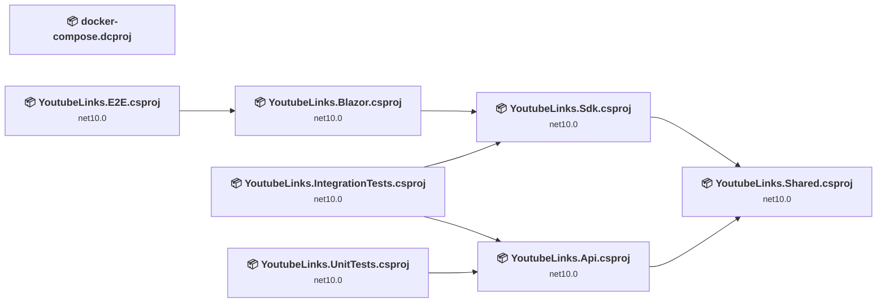
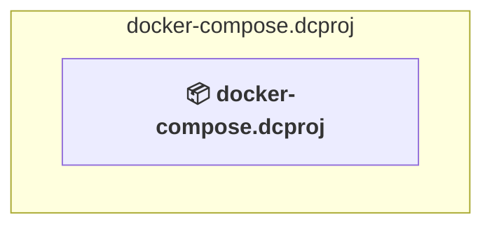
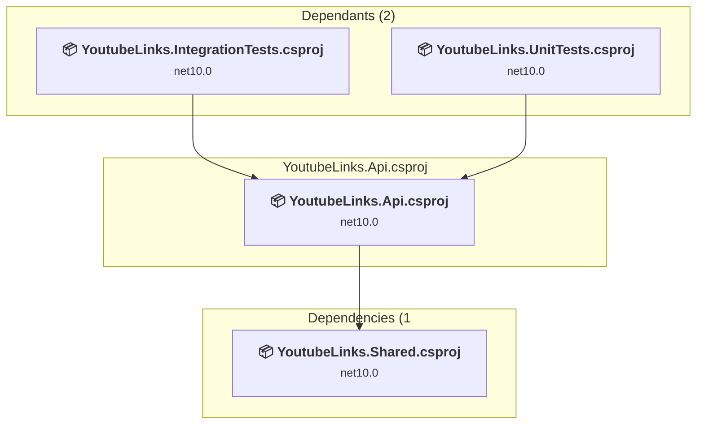
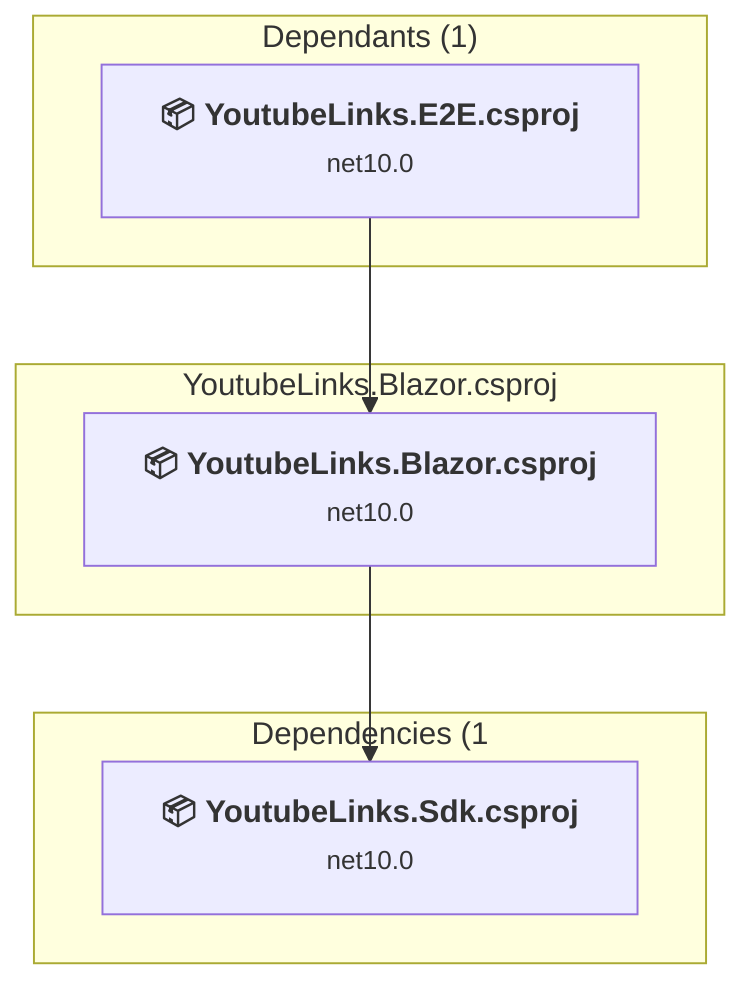
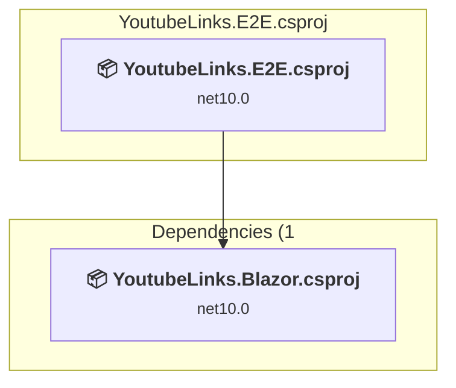
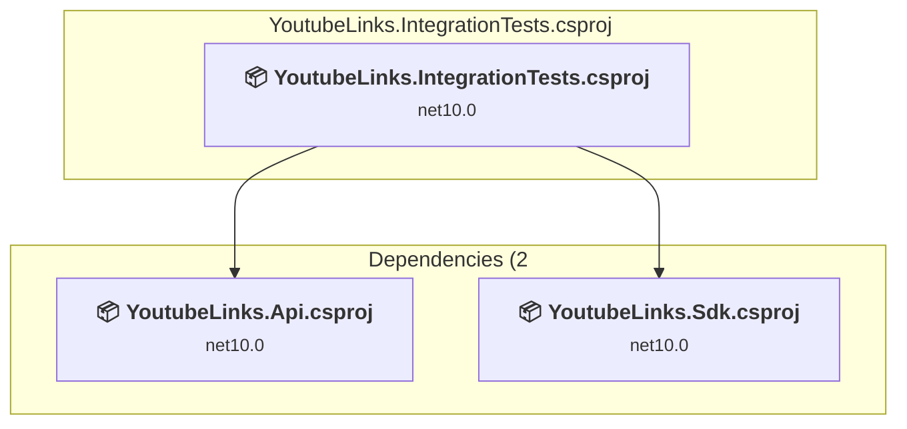
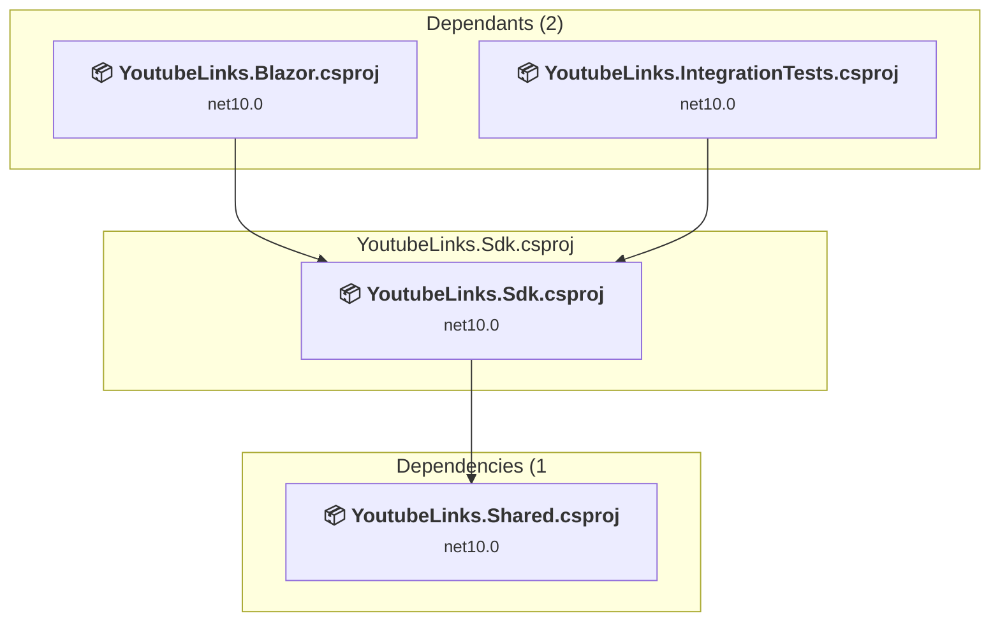
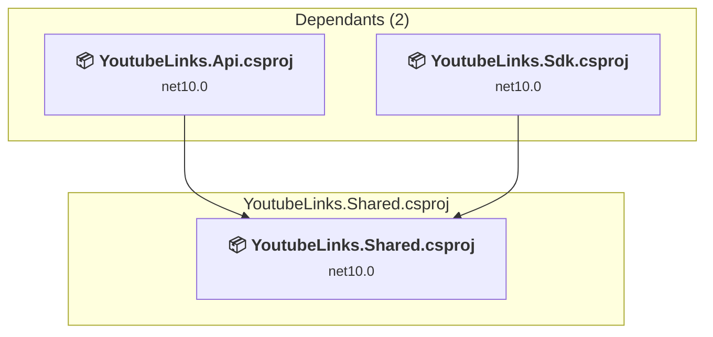
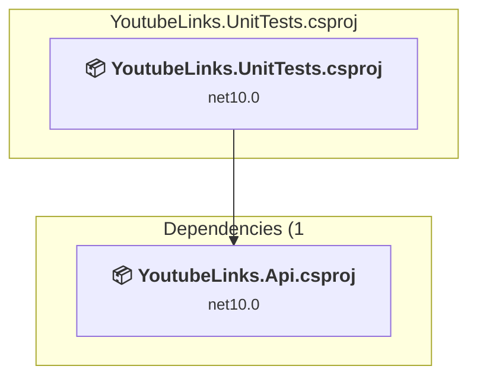

# Projects and dependencies analysis

This document provides a comprehensive overview of the projects and their dependencies in the context of upgrading to .NETCoreApp,Version=v11.0.

## Table of Contents

- [Executive Summary](#executive-Summary)
  - [Highlevel Metrics](#highlevel-metrics)
  - [Projects Compatibility](#projects-compatibility)
  - [Package Compatibility](#package-compatibility)
  - [API Compatibility](#api-compatibility)
  - [Binding Redirect Configuration](#binding-redirect-configuration)
- [Aggregate NuGet packages details](#aggregate-nuget-packages-details)
- [Top API Migration Challenges](#top-api-migration-challenges)
  - [Technologies and Features](#technologies-and-features)
  - [Most Frequent API Issues](#most-frequent-api-issues)
- [Projects Relationship Graph](#projects-relationship-graph)
- [Project Details](#project-details)

  - [docker-compose.dcproj](#docker-composedcproj)
  - [YoutubeLinks.Api\YoutubeLinks.Api.csproj](#youtubelinksapiyoutubelinksapicsproj)
  - [YoutubeLinks.Blazor\YoutubeLinks.Blazor.csproj](#youtubelinksblazoryoutubelinksblazorcsproj)
  - [YoutubeLinks.E2E\YoutubeLinks.E2E.csproj](#youtubelinkse2eyoutubelinkse2ecsproj)
  - [YoutubeLinks.IntegrationTests\YoutubeLinks.IntegrationTests.csproj](#youtubelinksintegrationtestsyoutubelinksintegrationtestscsproj)
  - [YoutubeLinks.Sdk\YoutubeLinks.Sdk.csproj](#youtubelinkssdkyoutubelinkssdkcsproj)
  - [YoutubeLinks.Shared\YoutubeLinks.Shared.csproj](#youtubelinkssharedyoutubelinkssharedcsproj)
  - [YoutubeLinks.UnitTests\YoutubeLinks.UnitTests.csproj](#youtubelinksunittestsyoutubelinksunittestscsproj)

## Executive Summary

### Highlevel Metrics

| Metric | Count | Status |
| :--- | :---: | :--- |
| Total Projects | 8 | 7 require upgrade |
| Total NuGet Packages | 190 | 2 need upgrade |
| Total Code Files | 301 |  |
| Total Code Files with Incidents | 29 |  |
| Total Lines of Code | 15904 |  |
| Total Number of Issues | 89 |  |
| Estimated LOC to modify | 79+ | at least 0,5% of codebase |

### Projects Compatibility

| Project | Target Framework | Difficulty | Package Issues | API Issues | Binding Issues | Est. LOC Impact | Description |
| :--- | :---: | :---: | :---: | :---: | :---: | :---: | :--- |
| [docker-compose.dcproj](#docker-composedcproj) |  | ✅ None | 0 | 0 | 0 |  | DotNetCoreApp, Sdk Style = True |
| [YoutubeLinks.Api\YoutubeLinks.Api.csproj](#youtubelinksapiyoutubelinksapicsproj) | net10.0 | 🟢 Low | 0 | 26 | 0 | 26+ | AspNetCore, Sdk Style = True |
| [YoutubeLinks.Blazor\YoutubeLinks.Blazor.csproj](#youtubelinksblazoryoutubelinksblazorcsproj) | net10.0 | 🟢 Low | 1 | 22 | 0 | 22+ | AspNetCore, Sdk Style = True |
| [YoutubeLinks.E2E\YoutubeLinks.E2E.csproj](#youtubelinkse2eyoutubelinkse2ecsproj) | net10.0 | 🟢 Low | 0 | 0 | 0 |  | DotNetCoreApp, Sdk Style = True |
| [YoutubeLinks.IntegrationTests\YoutubeLinks.IntegrationTests.csproj](#youtubelinksintegrationtestsyoutubelinksintegrationtestscsproj) | net10.0 | 🟢 Low | 1 | 19 | 0 | 19+ | DotNetCoreApp, Sdk Style = True |
| [YoutubeLinks.Sdk\YoutubeLinks.Sdk.csproj](#youtubelinkssdkyoutubelinkssdkcsproj) | net10.0 | 🟢 Low | 0 | 9 | 0 | 9+ | ClassLibrary, Sdk Style = True |
| [YoutubeLinks.Shared\YoutubeLinks.Shared.csproj](#youtubelinkssharedyoutubelinkssharedcsproj) | net10.0 | 🟢 Low | 0 | 3 | 0 | 3+ | ClassLibrary, Sdk Style = True |
| [YoutubeLinks.UnitTests\YoutubeLinks.UnitTests.csproj](#youtubelinksunittestsyoutubelinksunittestscsproj) | net10.0 | 🟢 Low | 1 | 0 | 0 |  | DotNetCoreApp, Sdk Style = True |

### Package Compatibility

| Status | Count | Percentage |
| :--- | :---: | :---: |
| ✅ Compatible | 188 | 98,9% |
| ⚠️ Incompatible | 1 | 0,5% |
| 🔄 Upgrade Recommended | 1 | 0,5% |
| ***Total NuGet Packages*** | ***190*** | ***100%*** |

### API Compatibility

| Category | Count | Impact |
| :--- | :---: | :--- |
| 🔴 Binary Incompatible | 30 | High - Require code changes |
| 🟡 Source Incompatible | 13 | Medium - Needs re-compilation and potential conflicting API error fixing |
| 🔵 Behavioral change | 36 | Low - Behavioral changes that may require testing at runtime |
| ✅ Compatible | 28772 |  |
| ***Total APIs Analyzed*** | ***28851*** |  |

## Aggregate NuGet packages details

| Package | Current Version | Suggested Version | Projects | Description |
| :--- | :---: | :---: | :--- | :--- |
| Azure.Core | 1.50.0 |  | [YoutubeLinks.Api.csproj](#youtubelinksapiyoutubelinksapicsproj) [YoutubeLinks.IntegrationTests.csproj](#youtubelinksintegrationtestsyoutubelinksintegrationtestscsproj) [YoutubeLinks.UnitTests.csproj](#youtubelinksunittestsyoutubelinksunittestscsproj) | ✅Compatible |
| Azure.Identity | 1.17.1 |  | [YoutubeLinks.Api.csproj](#youtubelinksapiyoutubelinksapicsproj) [YoutubeLinks.IntegrationTests.csproj](#youtubelinksintegrationtestsyoutubelinksintegrationtestscsproj) [YoutubeLinks.UnitTests.csproj](#youtubelinksunittestsyoutubelinksunittestscsproj) | ✅Compatible |
| Blazored.FluentValidation | 2.2.0 |  | [YoutubeLinks.Blazor.csproj](#youtubelinksblazoryoutubelinksblazorcsproj) [YoutubeLinks.E2E.csproj](#youtubelinkse2eyoutubelinkse2ecsproj) | ✅Compatible |
| Blazored.LocalStorage | 4.5.0 |  | [YoutubeLinks.Blazor.csproj](#youtubelinksblazoryoutubelinksblazorcsproj) [YoutubeLinks.E2E.csproj](#youtubelinkse2eyoutubelinkse2ecsproj) | ✅Compatible |
| BouncyCastle.Cryptography | 2.7.0 |  | [YoutubeLinks.IntegrationTests.csproj](#youtubelinksintegrationtestsyoutubelinksintegrationtestscsproj) | ✅Compatible |
| Castle.Core | 5.1.1 |  | [YoutubeLinks.UnitTests.csproj](#youtubelinksunittestsyoutubelinksunittestscsproj) | ✅Compatible |
| coverlet.collector | 10.0.1 |  | [YoutubeLinks.E2E.csproj](#youtubelinkse2eyoutubelinkse2ecsproj) [YoutubeLinks.IntegrationTests.csproj](#youtubelinksintegrationtestsyoutubelinksintegrationtestscsproj) [YoutubeLinks.UnitTests.csproj](#youtubelinksunittestsyoutubelinksunittestscsproj) | ✅Compatible |
| Docker.DotNet.Enhanced | 4.3.3 |  | [YoutubeLinks.IntegrationTests.csproj](#youtubelinksintegrationtestsyoutubelinksintegrationtestscsproj) | ✅Compatible |
| Docker.DotNet.Enhanced.Handler.Abstractions | 4.3.3 |  | [YoutubeLinks.IntegrationTests.csproj](#youtubelinksintegrationtestsyoutubelinksintegrationtestscsproj) | ✅Compatible |
| Docker.DotNet.Enhanced.LegacyHttp | 4.3.3 |  | [YoutubeLinks.IntegrationTests.csproj](#youtubelinksintegrationtestsyoutubelinksintegrationtestscsproj) | ✅Compatible |
| Docker.DotNet.Enhanced.NativeHttp | 4.3.3 |  | [YoutubeLinks.IntegrationTests.csproj](#youtubelinksintegrationtestsyoutubelinksintegrationtestscsproj) | ✅Compatible |
| Docker.DotNet.Enhanced.NPipe | 4.3.3 |  | [YoutubeLinks.IntegrationTests.csproj](#youtubelinksintegrationtestsyoutubelinksintegrationtestscsproj) | ✅Compatible |
| Docker.DotNet.Enhanced.Unix | 4.3.3 |  | [YoutubeLinks.IntegrationTests.csproj](#youtubelinksintegrationtestsyoutubelinksintegrationtestscsproj) | ✅Compatible |
| Docker.DotNet.Enhanced.X509 | 4.3.3 |  | [YoutubeLinks.IntegrationTests.csproj](#youtubelinksintegrationtestsyoutubelinksintegrationtestscsproj) | ✅Compatible |
| FluentEmail.Core | 3.0.2 |  | [YoutubeLinks.Api.csproj](#youtubelinksapiyoutubelinksapicsproj) [YoutubeLinks.IntegrationTests.csproj](#youtubelinksintegrationtestsyoutubelinksintegrationtestscsproj) [YoutubeLinks.UnitTests.csproj](#youtubelinksunittestsyoutubelinksunittestscsproj) | ✅Compatible |
| FluentEmail.Razor | 3.0.2 |  | [YoutubeLinks.Api.csproj](#youtubelinksapiyoutubelinksapicsproj) [YoutubeLinks.IntegrationTests.csproj](#youtubelinksintegrationtestsyoutubelinksintegrationtestscsproj) [YoutubeLinks.UnitTests.csproj](#youtubelinksunittestsyoutubelinksunittestscsproj) | ✅Compatible |
| FluentEmail.Smtp | 3.0.2 |  | [YoutubeLinks.Api.csproj](#youtubelinksapiyoutubelinksapicsproj) [YoutubeLinks.IntegrationTests.csproj](#youtubelinksintegrationtestsyoutubelinksintegrationtestscsproj) [YoutubeLinks.UnitTests.csproj](#youtubelinksunittestsyoutubelinksunittestscsproj) | ✅Compatible |
| FluentValidation | 12.1.1 |  | [YoutubeLinks.Api.csproj](#youtubelinksapiyoutubelinksapicsproj) [YoutubeLinks.Blazor.csproj](#youtubelinksblazoryoutubelinksblazorcsproj) [YoutubeLinks.E2E.csproj](#youtubelinkse2eyoutubelinkse2ecsproj) [YoutubeLinks.IntegrationTests.csproj](#youtubelinksintegrationtestsyoutubelinksintegrationtestscsproj) [YoutubeLinks.Sdk.csproj](#youtubelinkssdkyoutubelinkssdkcsproj) [YoutubeLinks.Shared.csproj](#youtubelinkssharedyoutubelinkssharedcsproj) [YoutubeLinks.UnitTests.csproj](#youtubelinksunittestsyoutubelinksunittestscsproj) | ✅Compatible |
| FluentValidation.DependencyInjectionExtensions | 12.1.1 |  | [YoutubeLinks.Api.csproj](#youtubelinksapiyoutubelinksapicsproj) [YoutubeLinks.Blazor.csproj](#youtubelinksblazoryoutubelinksblazorcsproj) [YoutubeLinks.E2E.csproj](#youtubelinkse2eyoutubelinkse2ecsproj) [YoutubeLinks.IntegrationTests.csproj](#youtubelinksintegrationtestsyoutubelinksintegrationtestscsproj) [YoutubeLinks.UnitTests.csproj](#youtubelinksunittestsyoutubelinksunittestscsproj) | ✅Compatible |
| Humanizer.Core | 2.14.1 |  | [YoutubeLinks.Api.csproj](#youtubelinksapiyoutubelinksapicsproj) | ✅Compatible |
| MediatR | 12.4.1 |  | [YoutubeLinks.Api.csproj](#youtubelinksapiyoutubelinksapicsproj) [YoutubeLinks.IntegrationTests.csproj](#youtubelinksintegrationtestsyoutubelinksintegrationtestscsproj) [YoutubeLinks.UnitTests.csproj](#youtubelinksunittestsyoutubelinksunittestscsproj) | ✅Compatible |
| MediatR.Contracts | 2.0.1 |  | [YoutubeLinks.Api.csproj](#youtubelinksapiyoutubelinksapicsproj) [YoutubeLinks.Blazor.csproj](#youtubelinksblazoryoutubelinksblazorcsproj) [YoutubeLinks.E2E.csproj](#youtubelinkse2eyoutubelinkse2ecsproj) [YoutubeLinks.IntegrationTests.csproj](#youtubelinksintegrationtestsyoutubelinksintegrationtestscsproj) [YoutubeLinks.Sdk.csproj](#youtubelinkssdkyoutubelinkssdkcsproj) [YoutubeLinks.Shared.csproj](#youtubelinkssharedyoutubelinkssharedcsproj) [YoutubeLinks.UnitTests.csproj](#youtubelinksunittestsyoutubelinksunittestscsproj) | ✅Compatible |
| Microsoft.ApplicationInsights | 2.23.0 |  | [YoutubeLinks.E2E.csproj](#youtubelinkse2eyoutubelinkse2ecsproj) | ✅Compatible |
| Microsoft.AspNetCore.App.Internal.Assets | 10.0.8 |  | [YoutubeLinks.Blazor.csproj](#youtubelinksblazoryoutubelinksblazorcsproj) | ✅Compatible |
| Microsoft.AspNetCore.Authentication.JwtBearer | 10.0.11 |  | [YoutubeLinks.Api.csproj](#youtubelinksapiyoutubelinksapicsproj) [YoutubeLinks.IntegrationTests.csproj](#youtubelinksintegrationtestsyoutubelinksintegrationtestscsproj) [YoutubeLinks.UnitTests.csproj](#youtubelinksunittestsyoutubelinksunittestscsproj) | ✅Compatible |
| Microsoft.AspNetCore.Authorization | 10.0.11 |  | [YoutubeLinks.Blazor.csproj](#youtubelinksblazoryoutubelinksblazorcsproj) [YoutubeLinks.E2E.csproj](#youtubelinkse2eyoutubelinkse2ecsproj) [YoutubeLinks.IntegrationTests.csproj](#youtubelinksintegrationtestsyoutubelinksintegrationtestscsproj) [YoutubeLinks.Sdk.csproj](#youtubelinkssdkyoutubelinkssdkcsproj) [YoutubeLinks.Shared.csproj](#youtubelinkssharedyoutubelinkssharedcsproj) [YoutubeLinks.UnitTests.csproj](#youtubelinksunittestsyoutubelinksunittestscsproj) | ✅Compatible |
| Microsoft.AspNetCore.Components | 10.0.11 |  | [YoutubeLinks.Blazor.csproj](#youtubelinksblazoryoutubelinksblazorcsproj) [YoutubeLinks.E2E.csproj](#youtubelinkse2eyoutubelinkse2ecsproj) [YoutubeLinks.IntegrationTests.csproj](#youtubelinksintegrationtestsyoutubelinksintegrationtestscsproj) [YoutubeLinks.Sdk.csproj](#youtubelinkssdkyoutubelinkssdkcsproj) [YoutubeLinks.Shared.csproj](#youtubelinkssharedyoutubelinkssharedcsproj) [YoutubeLinks.UnitTests.csproj](#youtubelinksunittestsyoutubelinksunittestscsproj) | ✅Compatible |
| Microsoft.AspNetCore.Components.Analyzers | 10.0.11 |  | [YoutubeLinks.Blazor.csproj](#youtubelinksblazoryoutubelinksblazorcsproj) [YoutubeLinks.E2E.csproj](#youtubelinkse2eyoutubelinkse2ecsproj) [YoutubeLinks.IntegrationTests.csproj](#youtubelinksintegrationtestsyoutubelinksintegrationtestscsproj) [YoutubeLinks.Sdk.csproj](#youtubelinkssdkyoutubelinkssdkcsproj) [YoutubeLinks.Shared.csproj](#youtubelinkssharedyoutubelinkssharedcsproj) [YoutubeLinks.UnitTests.csproj](#youtubelinksunittestsyoutubelinksunittestscsproj) | ✅Compatible |
| Microsoft.AspNetCore.Components.Authorization | 10.0.11 |  | [YoutubeLinks.Blazor.csproj](#youtubelinksblazoryoutubelinksblazorcsproj) [YoutubeLinks.E2E.csproj](#youtubelinkse2eyoutubelinkse2ecsproj) | ✅Compatible |
| Microsoft.AspNetCore.Components.Forms | 10.0.11 |  | [YoutubeLinks.Blazor.csproj](#youtubelinksblazoryoutubelinksblazorcsproj) [YoutubeLinks.E2E.csproj](#youtubelinkse2eyoutubelinkse2ecsproj) [YoutubeLinks.IntegrationTests.csproj](#youtubelinksintegrationtestsyoutubelinksintegrationtestscsproj) [YoutubeLinks.Sdk.csproj](#youtubelinkssdkyoutubelinkssdkcsproj) [YoutubeLinks.Shared.csproj](#youtubelinkssharedyoutubelinkssharedcsproj) [YoutubeLinks.UnitTests.csproj](#youtubelinksunittestsyoutubelinksunittestscsproj) | ✅Compatible |
| Microsoft.AspNetCore.Components.Web | 10.0.11 |  | [YoutubeLinks.Blazor.csproj](#youtubelinksblazoryoutubelinksblazorcsproj) [YoutubeLinks.E2E.csproj](#youtubelinkse2eyoutubelinkse2ecsproj) [YoutubeLinks.IntegrationTests.csproj](#youtubelinksintegrationtestsyoutubelinksintegrationtestscsproj) [YoutubeLinks.Sdk.csproj](#youtubelinkssdkyoutubelinkssdkcsproj) [YoutubeLinks.Shared.csproj](#youtubelinkssharedyoutubelinkssharedcsproj) [YoutubeLinks.UnitTests.csproj](#youtubelinksunittestsyoutubelinksunittestscsproj) | ✅Compatible |
| Microsoft.AspNetCore.Components.WebAssembly | 10.0.11 |  | [YoutubeLinks.Api.csproj](#youtubelinksapiyoutubelinksapicsproj) [YoutubeLinks.Blazor.csproj](#youtubelinksblazoryoutubelinksblazorcsproj) [YoutubeLinks.E2E.csproj](#youtubelinkse2eyoutubelinkse2ecsproj) [YoutubeLinks.IntegrationTests.csproj](#youtubelinksintegrationtestsyoutubelinksintegrationtestscsproj) [YoutubeLinks.Sdk.csproj](#youtubelinkssdkyoutubelinkssdkcsproj) [YoutubeLinks.Shared.csproj](#youtubelinkssharedyoutubelinkssharedcsproj) [YoutubeLinks.UnitTests.csproj](#youtubelinksunittestsyoutubelinksunittestscsproj) | ✅Compatible |
| Microsoft.AspNetCore.Components.WebAssembly.DevServer | 10.0.11 |  | [YoutubeLinks.Blazor.csproj](#youtubelinksblazoryoutubelinksblazorcsproj) | ✅Compatible |
| Microsoft.AspNetCore.Http | 2.2.2 |  | [YoutubeLinks.IntegrationTests.csproj](#youtubelinksintegrationtestsyoutubelinksintegrationtestscsproj) [YoutubeLinks.UnitTests.csproj](#youtubelinksunittestsyoutubelinksunittestscsproj) | ✅Compatible |
| Microsoft.AspNetCore.Http.Abstractions | 2.2.0 |  | [YoutubeLinks.IntegrationTests.csproj](#youtubelinksintegrationtestsyoutubelinksintegrationtestscsproj) [YoutubeLinks.UnitTests.csproj](#youtubelinksunittestsyoutubelinksunittestscsproj) | ✅Compatible |
| Microsoft.AspNetCore.Http.Features | 2.2.0 |  | [YoutubeLinks.IntegrationTests.csproj](#youtubelinksintegrationtestsyoutubelinksintegrationtestscsproj) [YoutubeLinks.UnitTests.csproj](#youtubelinksunittestsyoutubelinksunittestscsproj) | ✅Compatible |
| Microsoft.AspNetCore.Metadata | 10.0.11 |  | [YoutubeLinks.Blazor.csproj](#youtubelinksblazoryoutubelinksblazorcsproj) [YoutubeLinks.E2E.csproj](#youtubelinkse2eyoutubelinkse2ecsproj) [YoutubeLinks.IntegrationTests.csproj](#youtubelinksintegrationtestsyoutubelinksintegrationtestscsproj) [YoutubeLinks.Sdk.csproj](#youtubelinkssdkyoutubelinkssdkcsproj) [YoutubeLinks.Shared.csproj](#youtubelinkssharedyoutubelinkssharedcsproj) [YoutubeLinks.UnitTests.csproj](#youtubelinksunittestsyoutubelinksunittestscsproj) | ✅Compatible |
| Microsoft.AspNetCore.Mvc.Razor.Extensions | 5.0.0 |  | [YoutubeLinks.Api.csproj](#youtubelinksapiyoutubelinksapicsproj) [YoutubeLinks.IntegrationTests.csproj](#youtubelinksintegrationtestsyoutubelinksintegrationtestscsproj) [YoutubeLinks.UnitTests.csproj](#youtubelinksunittestsyoutubelinksunittestscsproj) | ✅Compatible |
| Microsoft.AspNetCore.Mvc.Testing | 10.0.11 |  | [YoutubeLinks.IntegrationTests.csproj](#youtubelinksintegrationtestsyoutubelinksintegrationtestscsproj) | ✅Compatible |
| Microsoft.AspNetCore.OpenApi | 10.0.11 |  | [YoutubeLinks.Api.csproj](#youtubelinksapiyoutubelinksapicsproj) [YoutubeLinks.IntegrationTests.csproj](#youtubelinksintegrationtestsyoutubelinksintegrationtestscsproj) [YoutubeLinks.UnitTests.csproj](#youtubelinksunittestsyoutubelinksunittestscsproj) | ✅Compatible |
| Microsoft.AspNetCore.Razor.Language | 5.0.0 |  | [YoutubeLinks.Api.csproj](#youtubelinksapiyoutubelinksapicsproj) [YoutubeLinks.IntegrationTests.csproj](#youtubelinksintegrationtestsyoutubelinksintegrationtestscsproj) [YoutubeLinks.UnitTests.csproj](#youtubelinksunittestsyoutubelinksunittestscsproj) | ✅Compatible |
| Microsoft.AspNetCore.TestHost | 10.0.11 |  | [YoutubeLinks.IntegrationTests.csproj](#youtubelinksintegrationtestsyoutubelinksintegrationtestscsproj) | ✅Compatible |
| Microsoft.AspNetCore.WebUtilities | 2.2.0 |  | [YoutubeLinks.IntegrationTests.csproj](#youtubelinksintegrationtestsyoutubelinksintegrationtestscsproj) [YoutubeLinks.UnitTests.csproj](#youtubelinksunittestsyoutubelinksunittestscsproj) | ✅Compatible |
| Microsoft.Bcl.AsyncInterfaces | 6.0.0 |  | [YoutubeLinks.E2E.csproj](#youtubelinkse2eyoutubelinkse2ecsproj) | ✅Compatible |
| Microsoft.Bcl.AsyncInterfaces | 8.0.0 |  | [YoutubeLinks.Api.csproj](#youtubelinksapiyoutubelinksapicsproj) [YoutubeLinks.IntegrationTests.csproj](#youtubelinksintegrationtestsyoutubelinksintegrationtestscsproj) [YoutubeLinks.UnitTests.csproj](#youtubelinksunittestsyoutubelinksunittestscsproj) | ✅Compatible |
| Microsoft.Bcl.Cryptography | 10.0.2 |  | [YoutubeLinks.Api.csproj](#youtubelinksapiyoutubelinksapicsproj) [YoutubeLinks.Blazor.csproj](#youtubelinksblazoryoutubelinksblazorcsproj) [YoutubeLinks.E2E.csproj](#youtubelinkse2eyoutubelinkse2ecsproj) [YoutubeLinks.IntegrationTests.csproj](#youtubelinksintegrationtestsyoutubelinksintegrationtestscsproj) [YoutubeLinks.UnitTests.csproj](#youtubelinksunittestsyoutubelinksunittestscsproj) | ✅Compatible |
| Microsoft.Build.Framework | 18.0.2 |  | [YoutubeLinks.Api.csproj](#youtubelinksapiyoutubelinksapicsproj) | ✅Compatible |
| Microsoft.CodeAnalysis.Analyzers | 3.0.0 |  | [YoutubeLinks.IntegrationTests.csproj](#youtubelinksintegrationtestsyoutubelinksintegrationtestscsproj) [YoutubeLinks.UnitTests.csproj](#youtubelinksunittestsyoutubelinksunittestscsproj) | ✅Compatible |
| Microsoft.CodeAnalysis.Analyzers | 3.11.0 |  | [YoutubeLinks.Api.csproj](#youtubelinksapiyoutubelinksapicsproj) | ✅Compatible |
| Microsoft.CodeAnalysis.Common | 3.7.0 |  | [YoutubeLinks.IntegrationTests.csproj](#youtubelinksintegrationtestsyoutubelinksintegrationtestscsproj) [YoutubeLinks.UnitTests.csproj](#youtubelinksunittestsyoutubelinksunittestscsproj) | ✅Compatible |
| Microsoft.CodeAnalysis.Common | 5.0.0 |  | [YoutubeLinks.Api.csproj](#youtubelinksapiyoutubelinksapicsproj) | ✅Compatible |
| Microsoft.CodeAnalysis.CSharp | 3.7.0 |  | [YoutubeLinks.IntegrationTests.csproj](#youtubelinksintegrationtestsyoutubelinksintegrationtestscsproj) [YoutubeLinks.UnitTests.csproj](#youtubelinksunittestsyoutubelinksunittestscsproj) | ✅Compatible |
| Microsoft.CodeAnalysis.CSharp | 5.0.0 |  | [YoutubeLinks.Api.csproj](#youtubelinksapiyoutubelinksapicsproj) | ✅Compatible |
| Microsoft.CodeAnalysis.CSharp.Workspaces | 5.0.0 |  | [YoutubeLinks.Api.csproj](#youtubelinksapiyoutubelinksapicsproj) | ✅Compatible |
| Microsoft.CodeAnalysis.Razor | 5.0.0 |  | [YoutubeLinks.Api.csproj](#youtubelinksapiyoutubelinksapicsproj) [YoutubeLinks.IntegrationTests.csproj](#youtubelinksintegrationtestsyoutubelinksintegrationtestscsproj) [YoutubeLinks.UnitTests.csproj](#youtubelinksunittestsyoutubelinksunittestscsproj) | ✅Compatible |
| Microsoft.CodeAnalysis.Workspaces.Common | 5.0.0 |  | [YoutubeLinks.Api.csproj](#youtubelinksapiyoutubelinksapicsproj) | ✅Compatible |
| Microsoft.CodeAnalysis.Workspaces.MSBuild | 5.0.0 |  | [YoutubeLinks.Api.csproj](#youtubelinksapiyoutubelinksapicsproj) | ✅Compatible |
| Microsoft.CodeCoverage | 18.9.0 |  | [YoutubeLinks.E2E.csproj](#youtubelinkse2eyoutubelinkse2ecsproj) [YoutubeLinks.IntegrationTests.csproj](#youtubelinksintegrationtestsyoutubelinksintegrationtestscsproj) [YoutubeLinks.UnitTests.csproj](#youtubelinksunittestsyoutubelinksunittestscsproj) | ✅Compatible |
| Microsoft.Data.SqlClient | 6.1.6 |  | [YoutubeLinks.Api.csproj](#youtubelinksapiyoutubelinksapicsproj) [YoutubeLinks.IntegrationTests.csproj](#youtubelinksintegrationtestsyoutubelinksintegrationtestscsproj) [YoutubeLinks.UnitTests.csproj](#youtubelinksunittestsyoutubelinksunittestscsproj) | ✅Compatible |
| Microsoft.Data.SqlClient.SNI.runtime | 6.0.2 |  | [YoutubeLinks.Api.csproj](#youtubelinksapiyoutubelinksapicsproj) [YoutubeLinks.IntegrationTests.csproj](#youtubelinksintegrationtestsyoutubelinksintegrationtestscsproj) [YoutubeLinks.UnitTests.csproj](#youtubelinksunittestsyoutubelinksunittestscsproj) | ✅Compatible |
| Microsoft.EntityFrameworkCore | 10.0.11 |  | [YoutubeLinks.Api.csproj](#youtubelinksapiyoutubelinksapicsproj) [YoutubeLinks.IntegrationTests.csproj](#youtubelinksintegrationtestsyoutubelinksintegrationtestscsproj) [YoutubeLinks.UnitTests.csproj](#youtubelinksunittestsyoutubelinksunittestscsproj) | ✅Compatible |
| Microsoft.EntityFrameworkCore.Abstractions | 10.0.11 |  | [YoutubeLinks.Api.csproj](#youtubelinksapiyoutubelinksapicsproj) [YoutubeLinks.IntegrationTests.csproj](#youtubelinksintegrationtestsyoutubelinksintegrationtestscsproj) [YoutubeLinks.UnitTests.csproj](#youtubelinksunittestsyoutubelinksunittestscsproj) | ✅Compatible |
| Microsoft.EntityFrameworkCore.Analyzers | 10.0.11 |  | [YoutubeLinks.Api.csproj](#youtubelinksapiyoutubelinksapicsproj) [YoutubeLinks.IntegrationTests.csproj](#youtubelinksintegrationtestsyoutubelinksintegrationtestscsproj) [YoutubeLinks.UnitTests.csproj](#youtubelinksunittestsyoutubelinksunittestscsproj) | ✅Compatible |
| Microsoft.EntityFrameworkCore.Design | 10.0.11 |  | [YoutubeLinks.Api.csproj](#youtubelinksapiyoutubelinksapicsproj) | ✅Compatible |
| Microsoft.EntityFrameworkCore.Relational | 10.0.11 |  | [YoutubeLinks.Api.csproj](#youtubelinksapiyoutubelinksapicsproj) [YoutubeLinks.IntegrationTests.csproj](#youtubelinksintegrationtestsyoutubelinksintegrationtestscsproj) [YoutubeLinks.UnitTests.csproj](#youtubelinksunittestsyoutubelinksunittestscsproj) | ✅Compatible |
| Microsoft.EntityFrameworkCore.SqlServer | 10.0.11 |  | [YoutubeLinks.Api.csproj](#youtubelinksapiyoutubelinksapicsproj) [YoutubeLinks.IntegrationTests.csproj](#youtubelinksintegrationtestsyoutubelinksintegrationtestscsproj) [YoutubeLinks.UnitTests.csproj](#youtubelinksunittestsyoutubelinksunittestscsproj) | ✅Compatible |
| Microsoft.Extensions.ApiDescription.Server | 10.0.0 |  | [YoutubeLinks.Api.csproj](#youtubelinksapiyoutubelinksapicsproj) [YoutubeLinks.IntegrationTests.csproj](#youtubelinksintegrationtestsyoutubelinksintegrationtestscsproj) [YoutubeLinks.UnitTests.csproj](#youtubelinksunittestsyoutubelinksunittestscsproj) | ✅Compatible |
| Microsoft.Extensions.Caching.Abstractions | 10.0.11 |  | [YoutubeLinks.IntegrationTests.csproj](#youtubelinksintegrationtestsyoutubelinksintegrationtestscsproj) [YoutubeLinks.UnitTests.csproj](#youtubelinksunittestsyoutubelinksunittestscsproj) | ✅Compatible |
| Microsoft.Extensions.Caching.Memory | 10.0.11 |  | [YoutubeLinks.IntegrationTests.csproj](#youtubelinksintegrationtestsyoutubelinksintegrationtestscsproj) [YoutubeLinks.UnitTests.csproj](#youtubelinksunittestsyoutubelinksunittestscsproj) | ✅Compatible |
| Microsoft.Extensions.Configuration | 10.0.11 |  | [YoutubeLinks.Blazor.csproj](#youtubelinksblazoryoutubelinksblazorcsproj) [YoutubeLinks.E2E.csproj](#youtubelinkse2eyoutubelinkse2ecsproj) [YoutubeLinks.IntegrationTests.csproj](#youtubelinksintegrationtestsyoutubelinksintegrationtestscsproj) [YoutubeLinks.Sdk.csproj](#youtubelinkssdkyoutubelinkssdkcsproj) [YoutubeLinks.Shared.csproj](#youtubelinkssharedyoutubelinkssharedcsproj) [YoutubeLinks.UnitTests.csproj](#youtubelinksunittestsyoutubelinksunittestscsproj) | ✅Compatible |
| Microsoft.Extensions.Configuration.Abstractions | 10.0.11 |  | [YoutubeLinks.Blazor.csproj](#youtubelinksblazoryoutubelinksblazorcsproj) [YoutubeLinks.E2E.csproj](#youtubelinkse2eyoutubelinkse2ecsproj) [YoutubeLinks.IntegrationTests.csproj](#youtubelinksintegrationtestsyoutubelinksintegrationtestscsproj) [YoutubeLinks.Sdk.csproj](#youtubelinkssdkyoutubelinkssdkcsproj) [YoutubeLinks.Shared.csproj](#youtubelinkssharedyoutubelinkssharedcsproj) [YoutubeLinks.UnitTests.csproj](#youtubelinksunittestsyoutubelinksunittestscsproj) | ✅Compatible |
| Microsoft.Extensions.Configuration.Binder | 10.0.11 |  | [YoutubeLinks.Blazor.csproj](#youtubelinksblazoryoutubelinksblazorcsproj) [YoutubeLinks.E2E.csproj](#youtubelinkse2eyoutubelinkse2ecsproj) [YoutubeLinks.IntegrationTests.csproj](#youtubelinksintegrationtestsyoutubelinksintegrationtestscsproj) [YoutubeLinks.Sdk.csproj](#youtubelinkssdkyoutubelinkssdkcsproj) [YoutubeLinks.Shared.csproj](#youtubelinkssharedyoutubelinkssharedcsproj) [YoutubeLinks.UnitTests.csproj](#youtubelinksunittestsyoutubelinksunittestscsproj) | ✅Compatible |
| Microsoft.Extensions.Configuration.CommandLine | 10.0.11 |  | [YoutubeLinks.IntegrationTests.csproj](#youtubelinksintegrationtestsyoutubelinksintegrationtestscsproj) | ✅Compatible |
| Microsoft.Extensions.Configuration.EnvironmentVariables | 10.0.11 |  | [YoutubeLinks.IntegrationTests.csproj](#youtubelinksintegrationtestsyoutubelinksintegrationtestscsproj) | ✅Compatible |
| Microsoft.Extensions.Configuration.FileExtensions | 10.0.11 |  | [YoutubeLinks.Blazor.csproj](#youtubelinksblazoryoutubelinksblazorcsproj) [YoutubeLinks.E2E.csproj](#youtubelinkse2eyoutubelinkse2ecsproj) [YoutubeLinks.IntegrationTests.csproj](#youtubelinksintegrationtestsyoutubelinksintegrationtestscsproj) [YoutubeLinks.Sdk.csproj](#youtubelinkssdkyoutubelinkssdkcsproj) [YoutubeLinks.Shared.csproj](#youtubelinkssharedyoutubelinkssharedcsproj) [YoutubeLinks.UnitTests.csproj](#youtubelinksunittestsyoutubelinksunittestscsproj) | ✅Compatible |
| Microsoft.Extensions.Configuration.Json | 10.0.11 |  | [YoutubeLinks.Blazor.csproj](#youtubelinksblazoryoutubelinksblazorcsproj) [YoutubeLinks.E2E.csproj](#youtubelinkse2eyoutubelinkse2ecsproj) [YoutubeLinks.IntegrationTests.csproj](#youtubelinksintegrationtestsyoutubelinksintegrationtestscsproj) [YoutubeLinks.Sdk.csproj](#youtubelinkssdkyoutubelinkssdkcsproj) [YoutubeLinks.Shared.csproj](#youtubelinkssharedyoutubelinkssharedcsproj) [YoutubeLinks.UnitTests.csproj](#youtubelinksunittestsyoutubelinksunittestscsproj) | ✅Compatible |
| Microsoft.Extensions.Configuration.UserSecrets | 10.0.11 |  | [YoutubeLinks.IntegrationTests.csproj](#youtubelinksintegrationtestsyoutubelinksintegrationtestscsproj) | ✅Compatible |
| Microsoft.Extensions.DependencyInjection | 10.0.11 |  | [YoutubeLinks.Blazor.csproj](#youtubelinksblazoryoutubelinksblazorcsproj) [YoutubeLinks.E2E.csproj](#youtubelinkse2eyoutubelinkse2ecsproj) [YoutubeLinks.IntegrationTests.csproj](#youtubelinksintegrationtestsyoutubelinksintegrationtestscsproj) [YoutubeLinks.Sdk.csproj](#youtubelinkssdkyoutubelinkssdkcsproj) [YoutubeLinks.Shared.csproj](#youtubelinkssharedyoutubelinkssharedcsproj) [YoutubeLinks.UnitTests.csproj](#youtubelinksunittestsyoutubelinksunittestscsproj) | ✅Compatible |
| Microsoft.Extensions.DependencyInjection.Abstractions | 10.0.11 |  | [YoutubeLinks.Blazor.csproj](#youtubelinksblazoryoutubelinksblazorcsproj) [YoutubeLinks.E2E.csproj](#youtubelinkse2eyoutubelinkse2ecsproj) [YoutubeLinks.IntegrationTests.csproj](#youtubelinksintegrationtestsyoutubelinksintegrationtestscsproj) [YoutubeLinks.Sdk.csproj](#youtubelinkssdkyoutubelinkssdkcsproj) [YoutubeLinks.Shared.csproj](#youtubelinkssharedyoutubelinkssharedcsproj) [YoutubeLinks.UnitTests.csproj](#youtubelinksunittestsyoutubelinksunittestscsproj) | ✅Compatible |
| Microsoft.Extensions.DependencyModel | 10.0.0 |  | [YoutubeLinks.UnitTests.csproj](#youtubelinksunittestsyoutubelinksunittestscsproj) | ✅Compatible |
| Microsoft.Extensions.DependencyModel | 10.0.11 |  | [YoutubeLinks.Api.csproj](#youtubelinksapiyoutubelinksapicsproj) [YoutubeLinks.IntegrationTests.csproj](#youtubelinksintegrationtestsyoutubelinksintegrationtestscsproj) | ✅Compatible |
| Microsoft.Extensions.DependencyModel | 8.0.2 |  | [YoutubeLinks.E2E.csproj](#youtubelinkse2eyoutubelinkse2ecsproj) | ✅Compatible |
| Microsoft.Extensions.Diagnostics | 10.0.11 |  | [YoutubeLinks.Blazor.csproj](#youtubelinksblazoryoutubelinksblazorcsproj) [YoutubeLinks.E2E.csproj](#youtubelinkse2eyoutubelinkse2ecsproj) [YoutubeLinks.IntegrationTests.csproj](#youtubelinksintegrationtestsyoutubelinksintegrationtestscsproj) [YoutubeLinks.Sdk.csproj](#youtubelinkssdkyoutubelinkssdkcsproj) [YoutubeLinks.Shared.csproj](#youtubelinkssharedyoutubelinkssharedcsproj) [YoutubeLinks.UnitTests.csproj](#youtubelinksunittestsyoutubelinksunittestscsproj) | ✅Compatible |
| Microsoft.Extensions.Diagnostics.Abstractions | 10.0.11 |  | [YoutubeLinks.Blazor.csproj](#youtubelinksblazoryoutubelinksblazorcsproj) [YoutubeLinks.E2E.csproj](#youtubelinkse2eyoutubelinkse2ecsproj) [YoutubeLinks.IntegrationTests.csproj](#youtubelinksintegrationtestsyoutubelinksintegrationtestscsproj) [YoutubeLinks.Sdk.csproj](#youtubelinkssdkyoutubelinkssdkcsproj) [YoutubeLinks.Shared.csproj](#youtubelinkssharedyoutubelinkssharedcsproj) [YoutubeLinks.UnitTests.csproj](#youtubelinksunittestsyoutubelinksunittestscsproj) | ✅Compatible |
| Microsoft.Extensions.FileProviders.Abstractions | 10.0.11 |  | [YoutubeLinks.Blazor.csproj](#youtubelinksblazoryoutubelinksblazorcsproj) [YoutubeLinks.E2E.csproj](#youtubelinkse2eyoutubelinkse2ecsproj) [YoutubeLinks.IntegrationTests.csproj](#youtubelinksintegrationtestsyoutubelinksintegrationtestscsproj) [YoutubeLinks.Sdk.csproj](#youtubelinkssdkyoutubelinkssdkcsproj) [YoutubeLinks.Shared.csproj](#youtubelinkssharedyoutubelinkssharedcsproj) [YoutubeLinks.UnitTests.csproj](#youtubelinksunittestsyoutubelinksunittestscsproj) | ✅Compatible |
| Microsoft.Extensions.FileProviders.Physical | 10.0.11 |  | [YoutubeLinks.Blazor.csproj](#youtubelinksblazoryoutubelinksblazorcsproj) [YoutubeLinks.E2E.csproj](#youtubelinkse2eyoutubelinkse2ecsproj) [YoutubeLinks.IntegrationTests.csproj](#youtubelinksintegrationtestsyoutubelinksintegrationtestscsproj) [YoutubeLinks.Sdk.csproj](#youtubelinkssdkyoutubelinkssdkcsproj) [YoutubeLinks.Shared.csproj](#youtubelinkssharedyoutubelinkssharedcsproj) [YoutubeLinks.UnitTests.csproj](#youtubelinksunittestsyoutubelinksunittestscsproj) | ✅Compatible |
| Microsoft.Extensions.FileSystemGlobbing | 10.0.11 |  | [YoutubeLinks.Blazor.csproj](#youtubelinksblazoryoutubelinksblazorcsproj) [YoutubeLinks.E2E.csproj](#youtubelinkse2eyoutubelinkse2ecsproj) [YoutubeLinks.IntegrationTests.csproj](#youtubelinksintegrationtestsyoutubelinksintegrationtestscsproj) [YoutubeLinks.Sdk.csproj](#youtubelinkssdkyoutubelinkssdkcsproj) [YoutubeLinks.Shared.csproj](#youtubelinkssharedyoutubelinkssharedcsproj) [YoutubeLinks.UnitTests.csproj](#youtubelinksunittestsyoutubelinksunittestscsproj) | ✅Compatible |
| Microsoft.Extensions.Hosting | 10.0.11 |  | [YoutubeLinks.IntegrationTests.csproj](#youtubelinksintegrationtestsyoutubelinksintegrationtestscsproj) | ✅Compatible |
| Microsoft.Extensions.Hosting.Abstractions | 10.0.0 |  | [YoutubeLinks.UnitTests.csproj](#youtubelinksunittestsyoutubelinksunittestscsproj) | ✅Compatible |
| Microsoft.Extensions.Hosting.Abstractions | 10.0.11 |  | [YoutubeLinks.IntegrationTests.csproj](#youtubelinksintegrationtestsyoutubelinksintegrationtestscsproj) | ✅Compatible |
| Microsoft.Extensions.Localization | 10.0.11 |  | [YoutubeLinks.Blazor.csproj](#youtubelinksblazoryoutubelinksblazorcsproj) [YoutubeLinks.E2E.csproj](#youtubelinkse2eyoutubelinkse2ecsproj) [YoutubeLinks.IntegrationTests.csproj](#youtubelinksintegrationtestsyoutubelinksintegrationtestscsproj) [YoutubeLinks.Sdk.csproj](#youtubelinkssdkyoutubelinkssdkcsproj) [YoutubeLinks.Shared.csproj](#youtubelinkssharedyoutubelinkssharedcsproj) [YoutubeLinks.UnitTests.csproj](#youtubelinksunittestsyoutubelinksunittestscsproj) | ✅Compatible |
| Microsoft.Extensions.Localization.Abstractions | 10.0.11 |  | [YoutubeLinks.Blazor.csproj](#youtubelinksblazoryoutubelinksblazorcsproj) [YoutubeLinks.E2E.csproj](#youtubelinkse2eyoutubelinkse2ecsproj) [YoutubeLinks.IntegrationTests.csproj](#youtubelinksintegrationtestsyoutubelinksintegrationtestscsproj) [YoutubeLinks.Sdk.csproj](#youtubelinkssdkyoutubelinkssdkcsproj) [YoutubeLinks.Shared.csproj](#youtubelinkssharedyoutubelinkssharedcsproj) [YoutubeLinks.UnitTests.csproj](#youtubelinksunittestsyoutubelinksunittestscsproj) | ✅Compatible |
| Microsoft.Extensions.Logging | 10.0.11 |  | [YoutubeLinks.Blazor.csproj](#youtubelinksblazoryoutubelinksblazorcsproj) [YoutubeLinks.E2E.csproj](#youtubelinkse2eyoutubelinkse2ecsproj) [YoutubeLinks.IntegrationTests.csproj](#youtubelinksintegrationtestsyoutubelinksintegrationtestscsproj) [YoutubeLinks.Sdk.csproj](#youtubelinkssdkyoutubelinkssdkcsproj) [YoutubeLinks.Shared.csproj](#youtubelinkssharedyoutubelinkssharedcsproj) [YoutubeLinks.UnitTests.csproj](#youtubelinksunittestsyoutubelinksunittestscsproj) | ✅Compatible |
| Microsoft.Extensions.Logging.Abstractions | 10.0.11 |  | [YoutubeLinks.Blazor.csproj](#youtubelinksblazoryoutubelinksblazorcsproj) [YoutubeLinks.E2E.csproj](#youtubelinkse2eyoutubelinkse2ecsproj) [YoutubeLinks.IntegrationTests.csproj](#youtubelinksintegrationtestsyoutubelinksintegrationtestscsproj) [YoutubeLinks.Sdk.csproj](#youtubelinkssdkyoutubelinkssdkcsproj) [YoutubeLinks.Shared.csproj](#youtubelinkssharedyoutubelinkssharedcsproj) [YoutubeLinks.UnitTests.csproj](#youtubelinksunittestsyoutubelinksunittestscsproj) | ✅Compatible |
| Microsoft.Extensions.Logging.Configuration | 10.0.11 |  | [YoutubeLinks.IntegrationTests.csproj](#youtubelinksintegrationtestsyoutubelinksintegrationtestscsproj) | ✅Compatible |
| Microsoft.Extensions.Logging.Console | 10.0.11 |  | [YoutubeLinks.IntegrationTests.csproj](#youtubelinksintegrationtestsyoutubelinksintegrationtestscsproj) | ✅Compatible |
| Microsoft.Extensions.Logging.Debug | 10.0.11 |  | [YoutubeLinks.IntegrationTests.csproj](#youtubelinksintegrationtestsyoutubelinksintegrationtestscsproj) | ✅Compatible |
| Microsoft.Extensions.Logging.EventLog | 10.0.11 |  | [YoutubeLinks.IntegrationTests.csproj](#youtubelinksintegrationtestsyoutubelinksintegrationtestscsproj) | ✅Compatible |
| Microsoft.Extensions.Logging.EventSource | 10.0.11 |  | [YoutubeLinks.IntegrationTests.csproj](#youtubelinksintegrationtestsyoutubelinksintegrationtestscsproj) | ✅Compatible |
| Microsoft.Extensions.ObjectPool | 2.2.0 |  | [YoutubeLinks.IntegrationTests.csproj](#youtubelinksintegrationtestsyoutubelinksintegrationtestscsproj) [YoutubeLinks.UnitTests.csproj](#youtubelinksunittestsyoutubelinksunittestscsproj) | ✅Compatible |
| Microsoft.Extensions.Options | 10.0.11 |  | [YoutubeLinks.Blazor.csproj](#youtubelinksblazoryoutubelinksblazorcsproj) [YoutubeLinks.E2E.csproj](#youtubelinkse2eyoutubelinkse2ecsproj) [YoutubeLinks.IntegrationTests.csproj](#youtubelinksintegrationtestsyoutubelinksintegrationtestscsproj) [YoutubeLinks.Sdk.csproj](#youtubelinkssdkyoutubelinkssdkcsproj) [YoutubeLinks.Shared.csproj](#youtubelinkssharedyoutubelinkssharedcsproj) [YoutubeLinks.UnitTests.csproj](#youtubelinksunittestsyoutubelinksunittestscsproj) | ✅Compatible |
| Microsoft.Extensions.Options.ConfigurationExtensions | 10.0.11 |  | [YoutubeLinks.Blazor.csproj](#youtubelinksblazoryoutubelinksblazorcsproj) [YoutubeLinks.E2E.csproj](#youtubelinkse2eyoutubelinkse2ecsproj) [YoutubeLinks.IntegrationTests.csproj](#youtubelinksintegrationtestsyoutubelinksintegrationtestscsproj) [YoutubeLinks.Sdk.csproj](#youtubelinkssdkyoutubelinkssdkcsproj) [YoutubeLinks.Shared.csproj](#youtubelinkssharedyoutubelinkssharedcsproj) [YoutubeLinks.UnitTests.csproj](#youtubelinksunittestsyoutubelinksunittestscsproj) | ✅Compatible |
| Microsoft.Extensions.Primitives | 10.0.11 |  | [YoutubeLinks.Blazor.csproj](#youtubelinksblazoryoutubelinksblazorcsproj) [YoutubeLinks.E2E.csproj](#youtubelinkse2eyoutubelinkse2ecsproj) [YoutubeLinks.IntegrationTests.csproj](#youtubelinksintegrationtestsyoutubelinksintegrationtestscsproj) [YoutubeLinks.Sdk.csproj](#youtubelinkssdkyoutubelinkssdkcsproj) [YoutubeLinks.Shared.csproj](#youtubelinkssharedyoutubelinkssharedcsproj) [YoutubeLinks.UnitTests.csproj](#youtubelinksunittestsyoutubelinksunittestscsproj) | ✅Compatible |
| Microsoft.Extensions.Validation | 10.0.11 |  | [YoutubeLinks.Blazor.csproj](#youtubelinksblazoryoutubelinksblazorcsproj) [YoutubeLinks.E2E.csproj](#youtubelinkse2eyoutubelinkse2ecsproj) [YoutubeLinks.IntegrationTests.csproj](#youtubelinksintegrationtestsyoutubelinksintegrationtestscsproj) [YoutubeLinks.Sdk.csproj](#youtubelinkssdkyoutubelinkssdkcsproj) [YoutubeLinks.Shared.csproj](#youtubelinkssharedyoutubelinkssharedcsproj) [YoutubeLinks.UnitTests.csproj](#youtubelinksunittestsyoutubelinksunittestscsproj) | ✅Compatible |
| Microsoft.Identity.Client | 4.84.2 |  | [YoutubeLinks.Api.csproj](#youtubelinksapiyoutubelinksapicsproj) [YoutubeLinks.IntegrationTests.csproj](#youtubelinksintegrationtestsyoutubelinksintegrationtestscsproj) [YoutubeLinks.UnitTests.csproj](#youtubelinksunittestsyoutubelinksunittestscsproj) | ✅Compatible |
| Microsoft.Identity.Client.Broker | 4.84.2 |  | [YoutubeLinks.Api.csproj](#youtubelinksapiyoutubelinksapicsproj) [YoutubeLinks.IntegrationTests.csproj](#youtubelinksintegrationtestsyoutubelinksintegrationtestscsproj) [YoutubeLinks.UnitTests.csproj](#youtubelinksunittestsyoutubelinksunittestscsproj) | ✅Compatible |
| Microsoft.Identity.Client.Extensions.Msal | 4.78.0 |  | [YoutubeLinks.Api.csproj](#youtubelinksapiyoutubelinksapicsproj) [YoutubeLinks.IntegrationTests.csproj](#youtubelinksintegrationtestsyoutubelinksintegrationtestscsproj) [YoutubeLinks.UnitTests.csproj](#youtubelinksunittestsyoutubelinksunittestscsproj) | ✅Compatible |
| Microsoft.Identity.Client.NativeInterop | 0.20.6 |  | [YoutubeLinks.Api.csproj](#youtubelinksapiyoutubelinksapicsproj) [YoutubeLinks.IntegrationTests.csproj](#youtubelinksintegrationtestsyoutubelinksintegrationtestscsproj) [YoutubeLinks.UnitTests.csproj](#youtubelinksunittestsyoutubelinksunittestscsproj) | ✅Compatible |
| Microsoft.IdentityModel.Abstractions | 8.19.2 |  | [YoutubeLinks.Api.csproj](#youtubelinksapiyoutubelinksapicsproj) [YoutubeLinks.IntegrationTests.csproj](#youtubelinksintegrationtestsyoutubelinksintegrationtestscsproj) [YoutubeLinks.UnitTests.csproj](#youtubelinksunittestsyoutubelinksunittestscsproj) | ✅Compatible |
| Microsoft.IdentityModel.Abstractions | 8.22.0 |  | [YoutubeLinks.Blazor.csproj](#youtubelinksblazoryoutubelinksblazorcsproj) [YoutubeLinks.E2E.csproj](#youtubelinkse2eyoutubelinkse2ecsproj) | ✅Compatible |
| Microsoft.IdentityModel.JsonWebTokens | 8.19.2 |  | [YoutubeLinks.Api.csproj](#youtubelinksapiyoutubelinksapicsproj) [YoutubeLinks.IntegrationTests.csproj](#youtubelinksintegrationtestsyoutubelinksintegrationtestscsproj) [YoutubeLinks.UnitTests.csproj](#youtubelinksunittestsyoutubelinksunittestscsproj) | ✅Compatible |
| Microsoft.IdentityModel.JsonWebTokens | 8.22.0 |  | [YoutubeLinks.Blazor.csproj](#youtubelinksblazoryoutubelinksblazorcsproj) [YoutubeLinks.E2E.csproj](#youtubelinkse2eyoutubelinkse2ecsproj) | ✅Compatible |
| Microsoft.IdentityModel.Logging | 8.19.2 |  | [YoutubeLinks.Api.csproj](#youtubelinksapiyoutubelinksapicsproj) [YoutubeLinks.IntegrationTests.csproj](#youtubelinksintegrationtestsyoutubelinksintegrationtestscsproj) [YoutubeLinks.UnitTests.csproj](#youtubelinksunittestsyoutubelinksunittestscsproj) | ✅Compatible |
| Microsoft.IdentityModel.Logging | 8.22.0 |  | [YoutubeLinks.Blazor.csproj](#youtubelinksblazoryoutubelinksblazorcsproj) [YoutubeLinks.E2E.csproj](#youtubelinkse2eyoutubelinkse2ecsproj) | ✅Compatible |
| Microsoft.IdentityModel.Protocols | 8.19.2 |  | [YoutubeLinks.Api.csproj](#youtubelinksapiyoutubelinksapicsproj) [YoutubeLinks.IntegrationTests.csproj](#youtubelinksintegrationtestsyoutubelinksintegrationtestscsproj) [YoutubeLinks.UnitTests.csproj](#youtubelinksunittestsyoutubelinksunittestscsproj) | ✅Compatible |
| Microsoft.IdentityModel.Protocols.OpenIdConnect | 8.19.2 |  | [YoutubeLinks.Api.csproj](#youtubelinksapiyoutubelinksapicsproj) [YoutubeLinks.IntegrationTests.csproj](#youtubelinksintegrationtestsyoutubelinksintegrationtestscsproj) [YoutubeLinks.UnitTests.csproj](#youtubelinksunittestsyoutubelinksunittestscsproj) | ✅Compatible |
| Microsoft.IdentityModel.Tokens | 8.19.2 |  | [YoutubeLinks.Api.csproj](#youtubelinksapiyoutubelinksapicsproj) [YoutubeLinks.IntegrationTests.csproj](#youtubelinksintegrationtestsyoutubelinksintegrationtestscsproj) [YoutubeLinks.UnitTests.csproj](#youtubelinksunittestsyoutubelinksunittestscsproj) | ✅Compatible |
| Microsoft.IdentityModel.Tokens | 8.22.0 |  | [YoutubeLinks.Blazor.csproj](#youtubelinksblazoryoutubelinksblazorcsproj) [YoutubeLinks.E2E.csproj](#youtubelinkse2eyoutubelinkse2ecsproj) | ✅Compatible |
| Microsoft.JSInterop | 10.0.11 |  | [YoutubeLinks.Blazor.csproj](#youtubelinksblazoryoutubelinksblazorcsproj) [YoutubeLinks.E2E.csproj](#youtubelinkse2eyoutubelinkse2ecsproj) [YoutubeLinks.IntegrationTests.csproj](#youtubelinksintegrationtestsyoutubelinksintegrationtestscsproj) [YoutubeLinks.Sdk.csproj](#youtubelinkssdkyoutubelinkssdkcsproj) [YoutubeLinks.Shared.csproj](#youtubelinkssharedyoutubelinkssharedcsproj) [YoutubeLinks.UnitTests.csproj](#youtubelinksunittestsyoutubelinksunittestscsproj) | ✅Compatible |
| Microsoft.JSInterop.WebAssembly | 10.0.11 |  | [YoutubeLinks.Api.csproj](#youtubelinksapiyoutubelinksapicsproj) [YoutubeLinks.Blazor.csproj](#youtubelinksblazoryoutubelinksblazorcsproj) [YoutubeLinks.E2E.csproj](#youtubelinkse2eyoutubelinkse2ecsproj) [YoutubeLinks.IntegrationTests.csproj](#youtubelinksintegrationtestsyoutubelinksintegrationtestscsproj) [YoutubeLinks.Sdk.csproj](#youtubelinkssdkyoutubelinkssdkcsproj) [YoutubeLinks.Shared.csproj](#youtubelinkssharedyoutubelinkssharedcsproj) [YoutubeLinks.UnitTests.csproj](#youtubelinksunittestsyoutubelinksunittestscsproj) | ✅Compatible |
| Microsoft.Net.Http.Headers | 2.2.0 |  | [YoutubeLinks.IntegrationTests.csproj](#youtubelinksintegrationtestsyoutubelinksintegrationtestscsproj) [YoutubeLinks.UnitTests.csproj](#youtubelinksunittestsyoutubelinksunittestscsproj) | ✅Compatible |
| Microsoft.NET.ILLink.Tasks | 10.0.8 | 10.0.11 | [YoutubeLinks.Blazor.csproj](#youtubelinksblazoryoutubelinksblazorcsproj) | NuGet package upgrade is recommended |
| Microsoft.NET.Sdk.WebAssembly.Pack | 10.0.8 |  | [YoutubeLinks.Blazor.csproj](#youtubelinksblazoryoutubelinksblazorcsproj) | ✅Compatible |
| Microsoft.NET.Test.Sdk | 18.9.0 |  | [YoutubeLinks.E2E.csproj](#youtubelinkse2eyoutubelinkse2ecsproj) [YoutubeLinks.IntegrationTests.csproj](#youtubelinksintegrationtestsyoutubelinksintegrationtestscsproj) [YoutubeLinks.UnitTests.csproj](#youtubelinksunittestsyoutubelinksunittestscsproj) | ✅Compatible |
| Microsoft.OpenApi | 2.7.5 |  | [YoutubeLinks.Api.csproj](#youtubelinksapiyoutubelinksapicsproj) [YoutubeLinks.IntegrationTests.csproj](#youtubelinksintegrationtestsyoutubelinksintegrationtestscsproj) [YoutubeLinks.UnitTests.csproj](#youtubelinksunittestsyoutubelinksunittestscsproj) | ✅Compatible |
| Microsoft.Playwright | 1.62.0 |  | [YoutubeLinks.E2E.csproj](#youtubelinkse2eyoutubelinkse2ecsproj) | ✅Compatible |
| Microsoft.Playwright.NUnit | 1.62.0 |  | [YoutubeLinks.E2E.csproj](#youtubelinkse2eyoutubelinkse2ecsproj) | ✅Compatible |
| Microsoft.Playwright.TestAdapter | 1.62.0 |  | [YoutubeLinks.E2E.csproj](#youtubelinkse2eyoutubelinkse2ecsproj) | ✅Compatible |
| Microsoft.SqlServer.Server | 1.0.0 |  | [YoutubeLinks.Api.csproj](#youtubelinksapiyoutubelinksapicsproj) [YoutubeLinks.IntegrationTests.csproj](#youtubelinksintegrationtestsyoutubelinksintegrationtestscsproj) [YoutubeLinks.UnitTests.csproj](#youtubelinksunittestsyoutubelinksunittestscsproj) | ✅Compatible |
| Microsoft.Testing.Extensions.Telemetry | 2.1.0 |  | [YoutubeLinks.E2E.csproj](#youtubelinkse2eyoutubelinkse2ecsproj) | ✅Compatible |
| Microsoft.Testing.Extensions.TrxReport.Abstractions | 2.1.0 |  | [YoutubeLinks.E2E.csproj](#youtubelinkse2eyoutubelinkse2ecsproj) | ✅Compatible |
| Microsoft.Testing.Extensions.VSTestBridge | 2.1.0 |  | [YoutubeLinks.E2E.csproj](#youtubelinkse2eyoutubelinkse2ecsproj) | ✅Compatible |
| Microsoft.Testing.Platform | 2.1.0 |  | [YoutubeLinks.E2E.csproj](#youtubelinkse2eyoutubelinkse2ecsproj) | ✅Compatible |
| Microsoft.Testing.Platform.MSBuild | 2.1.0 |  | [YoutubeLinks.E2E.csproj](#youtubelinkse2eyoutubelinkse2ecsproj) | ✅Compatible |
| Microsoft.TestPlatform.ObjectModel | 18.9.0 |  | [YoutubeLinks.E2E.csproj](#youtubelinkse2eyoutubelinkse2ecsproj) [YoutubeLinks.IntegrationTests.csproj](#youtubelinksintegrationtestsyoutubelinksintegrationtestscsproj) [YoutubeLinks.UnitTests.csproj](#youtubelinksunittestsyoutubelinksunittestscsproj) | ✅Compatible |
| Microsoft.TestPlatform.TestHost | 18.9.0 |  | [YoutubeLinks.E2E.csproj](#youtubelinkse2eyoutubelinkse2ecsproj) [YoutubeLinks.IntegrationTests.csproj](#youtubelinksintegrationtestsyoutubelinksintegrationtestscsproj) [YoutubeLinks.UnitTests.csproj](#youtubelinksunittestsyoutubelinksunittestscsproj) | ✅Compatible |
| Microsoft.VisualStudio.SolutionPersistence | 1.0.52 |  | [YoutubeLinks.Api.csproj](#youtubelinksapiyoutubelinksapicsproj) | ✅Compatible |
| Mono.TextTemplating | 3.0.0 |  | [YoutubeLinks.Api.csproj](#youtubelinksapiyoutubelinksapicsproj) | ✅Compatible |
| MudBlazor | 9.8.0 |  | [YoutubeLinks.Blazor.csproj](#youtubelinksblazoryoutubelinksblazorcsproj) [YoutubeLinks.E2E.csproj](#youtubelinkse2eyoutubelinkse2ecsproj) | ✅Compatible |
| Newtonsoft.Json | 13.0.4 |  | [YoutubeLinks.Api.csproj](#youtubelinksapiyoutubelinksapicsproj) [YoutubeLinks.Blazor.csproj](#youtubelinksblazoryoutubelinksblazorcsproj) [YoutubeLinks.E2E.csproj](#youtubelinkse2eyoutubelinkse2ecsproj) [YoutubeLinks.IntegrationTests.csproj](#youtubelinksintegrationtestsyoutubelinksintegrationtestscsproj) [YoutubeLinks.Sdk.csproj](#youtubelinkssdkyoutubelinkssdkcsproj) [YoutubeLinks.Shared.csproj](#youtubelinkssharedyoutubelinkssharedcsproj) [YoutubeLinks.UnitTests.csproj](#youtubelinksunittestsyoutubelinksunittestscsproj) | ✅Compatible |
| NSubstitute | 6.2.0 |  | [YoutubeLinks.UnitTests.csproj](#youtubelinksunittestsyoutubelinksunittestscsproj) | ✅Compatible |
| NUnit | 4.6.1 |  | [YoutubeLinks.E2E.csproj](#youtubelinkse2eyoutubelinkse2ecsproj) | ✅Compatible |
| NUnit.Analyzers | 4.14.0 |  | [YoutubeLinks.E2E.csproj](#youtubelinkse2eyoutubelinkse2ecsproj) | ✅Compatible |
| NUnit3TestAdapter | 6.2.0 |  | [YoutubeLinks.E2E.csproj](#youtubelinkse2eyoutubelinkse2ecsproj) | ✅Compatible |
| RazorLight | 2.0.0-rc.3 |  | [YoutubeLinks.Api.csproj](#youtubelinksapiyoutubelinksapicsproj) [YoutubeLinks.IntegrationTests.csproj](#youtubelinksintegrationtestsyoutubelinksintegrationtestscsproj) [YoutubeLinks.UnitTests.csproj](#youtubelinksunittestsyoutubelinksunittestscsproj) | ✅Compatible |
| Serilog | 4.4.0 |  | [YoutubeLinks.Api.csproj](#youtubelinksapiyoutubelinksapicsproj) [YoutubeLinks.IntegrationTests.csproj](#youtubelinksintegrationtestsyoutubelinksintegrationtestscsproj) [YoutubeLinks.UnitTests.csproj](#youtubelinksunittestsyoutubelinksunittestscsproj) | ✅Compatible |
| Serilog.AspNetCore | 10.0.0 |  | [YoutubeLinks.Api.csproj](#youtubelinksapiyoutubelinksapicsproj) [YoutubeLinks.IntegrationTests.csproj](#youtubelinksintegrationtestsyoutubelinksintegrationtestscsproj) [YoutubeLinks.UnitTests.csproj](#youtubelinksunittestsyoutubelinksunittestscsproj) | ✅Compatible |
| Serilog.Enrichers.CorrelationId | 3.0.1 |  | [YoutubeLinks.Api.csproj](#youtubelinksapiyoutubelinksapicsproj) [YoutubeLinks.IntegrationTests.csproj](#youtubelinksintegrationtestsyoutubelinksintegrationtestscsproj) [YoutubeLinks.UnitTests.csproj](#youtubelinksunittestsyoutubelinksunittestscsproj) | ✅Compatible |
| Serilog.Extensions.Hosting | 10.0.0 |  | [YoutubeLinks.Api.csproj](#youtubelinksapiyoutubelinksapicsproj) [YoutubeLinks.IntegrationTests.csproj](#youtubelinksintegrationtestsyoutubelinksintegrationtestscsproj) [YoutubeLinks.UnitTests.csproj](#youtubelinksunittestsyoutubelinksunittestscsproj) | ✅Compatible |
| Serilog.Extensions.Logging | 10.0.0 |  | [YoutubeLinks.Api.csproj](#youtubelinksapiyoutubelinksapicsproj) [YoutubeLinks.IntegrationTests.csproj](#youtubelinksintegrationtestsyoutubelinksintegrationtestscsproj) [YoutubeLinks.UnitTests.csproj](#youtubelinksunittestsyoutubelinksunittestscsproj) | ✅Compatible |
| Serilog.Formatting.Compact | 3.0.0 |  | [YoutubeLinks.Api.csproj](#youtubelinksapiyoutubelinksapicsproj) [YoutubeLinks.IntegrationTests.csproj](#youtubelinksintegrationtestsyoutubelinksintegrationtestscsproj) [YoutubeLinks.UnitTests.csproj](#youtubelinksunittestsyoutubelinksunittestscsproj) | ✅Compatible |
| Serilog.Settings.Configuration | 10.0.0 |  | [YoutubeLinks.Api.csproj](#youtubelinksapiyoutubelinksapicsproj) [YoutubeLinks.IntegrationTests.csproj](#youtubelinksintegrationtestsyoutubelinksintegrationtestscsproj) [YoutubeLinks.UnitTests.csproj](#youtubelinksunittestsyoutubelinksunittestscsproj) | ✅Compatible |
| Serilog.Sinks.Console | 6.1.1 |  | [YoutubeLinks.Api.csproj](#youtubelinksapiyoutubelinksapicsproj) [YoutubeLinks.IntegrationTests.csproj](#youtubelinksintegrationtestsyoutubelinksintegrationtestscsproj) [YoutubeLinks.UnitTests.csproj](#youtubelinksunittestsyoutubelinksunittestscsproj) | ✅Compatible |
| Serilog.Sinks.Debug | 3.0.0 |  | [YoutubeLinks.Api.csproj](#youtubelinksapiyoutubelinksapicsproj) [YoutubeLinks.IntegrationTests.csproj](#youtubelinksintegrationtestsyoutubelinksintegrationtestscsproj) [YoutubeLinks.UnitTests.csproj](#youtubelinksunittestsyoutubelinksunittestscsproj) | ✅Compatible |
| Serilog.Sinks.File | 7.0.0 |  | [YoutubeLinks.Api.csproj](#youtubelinksapiyoutubelinksapicsproj) [YoutubeLinks.IntegrationTests.csproj](#youtubelinksintegrationtestsyoutubelinksintegrationtestscsproj) [YoutubeLinks.UnitTests.csproj](#youtubelinksunittestsyoutubelinksunittestscsproj) | ✅Compatible |
| Serilog.Sinks.Seq | 9.1.0 |  | [YoutubeLinks.Api.csproj](#youtubelinksapiyoutubelinksapicsproj) [YoutubeLinks.IntegrationTests.csproj](#youtubelinksintegrationtestsyoutubelinksintegrationtestscsproj) [YoutubeLinks.UnitTests.csproj](#youtubelinksunittestsyoutubelinksunittestscsproj) | ✅Compatible |
| SharpZipLib | 1.4.2 |  | [YoutubeLinks.IntegrationTests.csproj](#youtubelinksintegrationtestsyoutubelinksintegrationtestscsproj) | ✅Compatible |
| SSH.NET | 2026.0.0 |  | [YoutubeLinks.IntegrationTests.csproj](#youtubelinksintegrationtestsyoutubelinksintegrationtestscsproj) | ✅Compatible |
| Swashbuckle.AspNetCore | 10.2.3 |  | [YoutubeLinks.Api.csproj](#youtubelinksapiyoutubelinksapicsproj) [YoutubeLinks.IntegrationTests.csproj](#youtubelinksintegrationtestsyoutubelinksintegrationtestscsproj) [YoutubeLinks.UnitTests.csproj](#youtubelinksunittestsyoutubelinksunittestscsproj) | ✅Compatible |
| Swashbuckle.AspNetCore.Swagger | 10.2.3 |  | [YoutubeLinks.Api.csproj](#youtubelinksapiyoutubelinksapicsproj) [YoutubeLinks.IntegrationTests.csproj](#youtubelinksintegrationtestsyoutubelinksintegrationtestscsproj) [YoutubeLinks.UnitTests.csproj](#youtubelinksunittestsyoutubelinksunittestscsproj) | ✅Compatible |
| Swashbuckle.AspNetCore.SwaggerGen | 10.2.3 |  | [YoutubeLinks.Api.csproj](#youtubelinksapiyoutubelinksapicsproj) [YoutubeLinks.IntegrationTests.csproj](#youtubelinksintegrationtestsyoutubelinksintegrationtestscsproj) [YoutubeLinks.UnitTests.csproj](#youtubelinksunittestsyoutubelinksunittestscsproj) | ✅Compatible |
| Swashbuckle.AspNetCore.SwaggerUI | 10.2.3 |  | [YoutubeLinks.Api.csproj](#youtubelinksapiyoutubelinksapicsproj) [YoutubeLinks.IntegrationTests.csproj](#youtubelinksintegrationtestsyoutubelinksintegrationtestscsproj) [YoutubeLinks.UnitTests.csproj](#youtubelinksunittestsyoutubelinksunittestscsproj) | ✅Compatible |
| System.ClientModel | 1.8.0 |  | [YoutubeLinks.Api.csproj](#youtubelinksapiyoutubelinksapicsproj) [YoutubeLinks.IntegrationTests.csproj](#youtubelinksintegrationtestsyoutubelinksintegrationtestscsproj) [YoutubeLinks.UnitTests.csproj](#youtubelinksunittestsyoutubelinksunittestscsproj) | ✅Compatible |
| System.CodeDom | 6.0.0 |  | [YoutubeLinks.Api.csproj](#youtubelinksapiyoutubelinksapicsproj) | ✅Compatible |
| System.ComponentModel.Annotations | 5.0.0 |  | [YoutubeLinks.E2E.csproj](#youtubelinkse2eyoutubelinkse2ecsproj) | ✅Compatible |
| System.Composition | 9.0.0 |  | [YoutubeLinks.Api.csproj](#youtubelinksapiyoutubelinksapicsproj) | ✅Compatible |
| System.Composition.AttributedModel | 9.0.0 |  | [YoutubeLinks.Api.csproj](#youtubelinksapiyoutubelinksapicsproj) | ✅Compatible |
| System.Composition.Convention | 9.0.0 |  | [YoutubeLinks.Api.csproj](#youtubelinksapiyoutubelinksapicsproj) | ✅Compatible |
| System.Composition.Hosting | 9.0.0 |  | [YoutubeLinks.Api.csproj](#youtubelinksapiyoutubelinksapicsproj) | ✅Compatible |
| System.Composition.Runtime | 9.0.0 |  | [YoutubeLinks.Api.csproj](#youtubelinksapiyoutubelinksapicsproj) | ✅Compatible |
| System.Composition.TypedParts | 9.0.0 |  | [YoutubeLinks.Api.csproj](#youtubelinksapiyoutubelinksapicsproj) | ✅Compatible |
| System.Configuration.ConfigurationManager | 9.0.11 |  | [YoutubeLinks.Api.csproj](#youtubelinksapiyoutubelinksapicsproj) [YoutubeLinks.IntegrationTests.csproj](#youtubelinksintegrationtestsyoutubelinksintegrationtestscsproj) [YoutubeLinks.UnitTests.csproj](#youtubelinksunittestsyoutubelinksunittestscsproj) | ✅Compatible |
| System.Diagnostics.EventLog | 10.0.11 |  | [YoutubeLinks.IntegrationTests.csproj](#youtubelinksintegrationtestsyoutubelinksintegrationtestscsproj) | ✅Compatible |
| System.Diagnostics.EventLog | 9.0.11 |  | [YoutubeLinks.UnitTests.csproj](#youtubelinksunittestsyoutubelinksunittestscsproj) | ✅Compatible |
| System.IdentityModel.Tokens.Jwt | 8.19.2 |  | [YoutubeLinks.Api.csproj](#youtubelinksapiyoutubelinksapicsproj) [YoutubeLinks.IntegrationTests.csproj](#youtubelinksintegrationtestsyoutubelinksintegrationtestscsproj) [YoutubeLinks.UnitTests.csproj](#youtubelinksunittestsyoutubelinksunittestscsproj) | ✅Compatible |
| System.IdentityModel.Tokens.Jwt | 8.22.0 |  | [YoutubeLinks.Blazor.csproj](#youtubelinksblazoryoutubelinksblazorcsproj) [YoutubeLinks.E2E.csproj](#youtubelinkse2eyoutubelinkse2ecsproj) | ✅Compatible |
| System.Memory.Data | 8.0.1 |  | [YoutubeLinks.Api.csproj](#youtubelinksapiyoutubelinksapicsproj) [YoutubeLinks.IntegrationTests.csproj](#youtubelinksintegrationtestsyoutubelinksintegrationtestscsproj) [YoutubeLinks.UnitTests.csproj](#youtubelinksunittestsyoutubelinksunittestscsproj) | ✅Compatible |
| System.Security.Cryptography.Pkcs | 9.0.11 |  | [YoutubeLinks.Api.csproj](#youtubelinksapiyoutubelinksapicsproj) [YoutubeLinks.IntegrationTests.csproj](#youtubelinksintegrationtestsyoutubelinksintegrationtestscsproj) [YoutubeLinks.UnitTests.csproj](#youtubelinksunittestsyoutubelinksunittestscsproj) | ✅Compatible |
| System.Security.Cryptography.ProtectedData | 9.0.11 |  | [YoutubeLinks.Api.csproj](#youtubelinksapiyoutubelinksapicsproj) [YoutubeLinks.IntegrationTests.csproj](#youtubelinksintegrationtestsyoutubelinksintegrationtestscsproj) [YoutubeLinks.UnitTests.csproj](#youtubelinksunittestsyoutubelinksunittestscsproj) | ✅Compatible |
| Testcontainers | 4.14.0 |  | [YoutubeLinks.IntegrationTests.csproj](#youtubelinksintegrationtestsyoutubelinksintegrationtestscsproj) | ✅Compatible |
| Testcontainers.MsSql | 4.14.0 |  | [YoutubeLinks.IntegrationTests.csproj](#youtubelinksintegrationtestsyoutubelinksintegrationtestscsproj) | ✅Compatible |
| xunit | 2.9.3 |  | [YoutubeLinks.IntegrationTests.csproj](#youtubelinksintegrationtestsyoutubelinksintegrationtestscsproj) [YoutubeLinks.UnitTests.csproj](#youtubelinksunittestsyoutubelinksunittestscsproj) | ⚠️NuGet package is deprecated |
| xunit.abstractions | 2.0.3 |  | [YoutubeLinks.IntegrationTests.csproj](#youtubelinksintegrationtestsyoutubelinksintegrationtestscsproj) [YoutubeLinks.UnitTests.csproj](#youtubelinksunittestsyoutubelinksunittestscsproj) | ✅Compatible |
| xunit.analyzers | 1.18.0 |  | [YoutubeLinks.IntegrationTests.csproj](#youtubelinksintegrationtestsyoutubelinksintegrationtestscsproj) [YoutubeLinks.UnitTests.csproj](#youtubelinksunittestsyoutubelinksunittestscsproj) | ✅Compatible |
| xunit.assert | 2.9.3 |  | [YoutubeLinks.IntegrationTests.csproj](#youtubelinksintegrationtestsyoutubelinksintegrationtestscsproj) [YoutubeLinks.UnitTests.csproj](#youtubelinksunittestsyoutubelinksunittestscsproj) | ✅Compatible |
| xunit.core | 2.9.3 |  | [YoutubeLinks.IntegrationTests.csproj](#youtubelinksintegrationtestsyoutubelinksintegrationtestscsproj) [YoutubeLinks.UnitTests.csproj](#youtubelinksunittestsyoutubelinksunittestscsproj) | ✅Compatible |
| xunit.extensibility.core | 2.9.3 |  | [YoutubeLinks.IntegrationTests.csproj](#youtubelinksintegrationtestsyoutubelinksintegrationtestscsproj) [YoutubeLinks.UnitTests.csproj](#youtubelinksunittestsyoutubelinksunittestscsproj) | ✅Compatible |
| xunit.extensibility.execution | 2.9.3 |  | [YoutubeLinks.IntegrationTests.csproj](#youtubelinksintegrationtestsyoutubelinksintegrationtestscsproj) [YoutubeLinks.UnitTests.csproj](#youtubelinksunittestsyoutubelinksunittestscsproj) | ✅Compatible |
| xunit.runner.visualstudio | 4.0.0 |  | [YoutubeLinks.IntegrationTests.csproj](#youtubelinksintegrationtestsyoutubelinksintegrationtestscsproj) [YoutubeLinks.UnitTests.csproj](#youtubelinksunittestsyoutubelinksunittestscsproj) | ✅Compatible |
| YoutubeDLSharp | 1.2.0 |  | [YoutubeLinks.Api.csproj](#youtubelinksapiyoutubelinksapicsproj) [YoutubeLinks.IntegrationTests.csproj](#youtubelinksintegrationtestsyoutubelinksintegrationtestscsproj) [YoutubeLinks.UnitTests.csproj](#youtubelinksunittestsyoutubelinksunittestscsproj) | ✅Compatible |

## Top API Migration Challenges

### Technologies and Features

| Technology | Issues | Percentage | Migration Path |
| :--- | :---: | :---: | :--- |
| IdentityModel & Claims-based Security | 23 | 29,1% | Windows Identity Foundation (WIF), SAML, and claims-based authentication APIs that have been replaced by modern identity libraries. WIF was the original identity framework for .NET Framework. Migrate to Microsoft.IdentityModel.* packages (modern identity stack). |

### Most Frequent API Issues

| API | Count | Percentage | Category |
| :--- | :---: | :---: | :--- |
| T:System.Net.Http.HttpContent | 20 | 25,3% | Behavioral Change |
| T:System.Uri | 8 | 10,1% | Behavioral Change |
| M:System.Net.Http.HttpContent.ReadAsStreamAsync | 7 | 8,9% | Behavioral Change |
| M:Microsoft.Extensions.DependencyInjection.OptionsConfigurationServiceCollectionExtensions.Configure''1(Microsoft.Extensions.DependencyInjection.IServiceCollection,Microsoft.Extensions.Configuration.IConfiguration) | 6 | 7,6% | Binary Incompatible |
| T:System.IdentityModel.Tokens.Jwt.JwtSecurityTokenHandler | 5 | 6,3% | Binary Incompatible |
| P:System.IdentityModel.Tokens.Jwt.JwtSecurityToken.Claims | 5 | 6,3% | Binary Incompatible |
| T:Microsoft.AspNetCore.Authentication.JwtBearer.JwtBearerDefaults | 2 | 2,5% | Source Incompatible |
| F:Microsoft.AspNetCore.Authentication.JwtBearer.JwtBearerDefaults.AuthenticationScheme | 2 | 2,5% | Source Incompatible |
| M:System.IdentityModel.Tokens.Jwt.JwtSecurityTokenHandler.WriteToken(Microsoft.IdentityModel.Tokens.SecurityToken) | 2 | 2,5% | Binary Incompatible |
| T:System.IdentityModel.Tokens.Jwt.JwtSecurityToken | 2 | 2,5% | Binary Incompatible |
| M:System.IdentityModel.Tokens.Jwt.JwtSecurityToken.#ctor(System.String,System.String,System.Collections.Generic.IEnumerable{System.Security.Claims.Claim},System.Nullable{System.DateTime},System.Nullable{System.DateTime},Microsoft.IdentityModel.Tokens.SigningCredentials) | 2 | 2,5% | Binary Incompatible |
| M:System.IdentityModel.Tokens.Jwt.JwtSecurityTokenHandler.ReadToken(System.String) | 2 | 2,5% | Binary Incompatible |
| M:System.IdentityModel.Tokens.Jwt.JwtSecurityTokenHandler.CanReadToken(System.String) | 2 | 2,5% | Binary Incompatible |
| M:System.IdentityModel.Tokens.Jwt.JwtSecurityTokenHandler.#ctor | 2 | 2,5% | Binary Incompatible |
| M:System.TimeSpan.FromMinutes(System.Int64) | 2 | 2,5% | Source Incompatible |
| T:Microsoft.Extensions.DependencyInjection.ServiceCollectionExtensions | 1 | 1,3% | Binary Incompatible |
| P:Microsoft.AspNetCore.Authentication.JwtBearer.JwtBearerOptions.TokenValidationParameters | 1 | 1,3% | Source Incompatible |
| P:Microsoft.AspNetCore.Authentication.JwtBearer.JwtBearerOptions.IncludeErrorDetails | 1 | 1,3% | Source Incompatible |
| P:Microsoft.AspNetCore.Authentication.JwtBearer.JwtBearerOptions.Audience | 1 | 1,3% | Source Incompatible |
| T:Microsoft.Extensions.DependencyInjection.JwtBearerExtensions | 1 | 1,3% | Source Incompatible |
| M:Microsoft.Extensions.DependencyInjection.JwtBearerExtensions.AddJwtBearer(Microsoft.AspNetCore.Authentication.AuthenticationBuilder,System.Action{Microsoft.AspNetCore.Authentication.JwtBearer.JwtBearerOptions}) | 1 | 1,3% | Source Incompatible |
| P:System.IdentityModel.Tokens.Jwt.JwtSecurityToken.ValidTo | 1 | 1,3% | Binary Incompatible |
| M:System.Uri.#ctor(System.String) | 1 | 1,3% | Behavioral Change |
| M:System.TimeSpan.FromDays(System.Int32) | 1 | 1,3% | Source Incompatible |
| M:System.TimeSpan.FromHours(System.Int32) | 1 | 1,3% | Source Incompatible |

## Projects Relationship Graph

Legend:
📦 SDK-style project
⚙️ Classic project

## Project Details

### docker-compose.dcproj

#### Project Info

- **Current Target Framework:** ✅
- **SDK-style**: True
- **Project Kind:** DotNetCoreApp
- **Dependencies**: 0
- **Dependants**: 0
- **Number of Files**: 0
- **Lines of Code**: 0
- **Estimated LOC to modify**: 0+ (at least 0,0% of the project)

#### Dependency Graph

Legend:
📦 SDK-style project
⚙️ Classic project

### API Compatibility

| Category | Count | Impact |
| :--- | :---: | :--- |
| 🔴 Binary Incompatible | 0 | High - Require code changes |
| 🟡 Source Incompatible | 0 | Medium - Needs re-compilation and potential conflicting API error fixing |
| 🔵 Behavioral change | 0 | Low - Behavioral changes that may require testing at runtime |
| ✅ Compatible | 0 |  |
| ***Total APIs Analyzed*** | ***0*** |  |

### YoutubeLinks.Api\YoutubeLinks.Api.csproj

#### Project Info

- **Current Target Framework:** net10.0
- **Proposed Target Framework:** net11.0
- **SDK-style**: True
- **Project Kind:** AspNetCore
- **Dependencies**: 1
- **Dependants**: 2
- **Number of Files**: 110
- **Number of Files with Incidents**: 9
- **Lines of Code**: 5179
- **Estimated LOC to modify**: 26+ (at least 0,5% of the project)

#### Dependency Graph

Legend:
📦 SDK-style project
⚙️ Classic project

### API Compatibility

| Category | Count | Impact |
| :--- | :---: | :--- |
| 🔴 Binary Incompatible | 15 | High - Require code changes |
| 🟡 Source Incompatible | 9 | Medium - Needs re-compilation and potential conflicting API error fixing |
| 🔵 Behavioral change | 2 | Low - Behavioral changes that may require testing at runtime |
| ✅ Compatible | 5442 |  |
| ***Total APIs Analyzed*** | ***5468*** |  |

#### Project Technologies and Features

| Technology | Issues | Percentage | Migration Path |
| :--- | :---: | :---: | :--- |
| IdentityModel & Claims-based Security | 9 | 34,6% | Windows Identity Foundation (WIF), SAML, and claims-based authentication APIs that have been replaced by modern identity libraries. WIF was the original identity framework for .NET Framework. Migrate to Microsoft.IdentityModel.* packages (modern identity stack). |

### YoutubeLinks.Blazor\YoutubeLinks.Blazor.csproj

#### Project Info

- **Current Target Framework:** net10.0
- **Proposed Target Framework:** net11.0
- **SDK-style**: True
- **Project Kind:** AspNetCore
- **Dependencies**: 1
- **Dependants**: 1
- **Number of Files**: 102
- **Number of Files with Incidents**: 8
- **Lines of Code**: 3001
- **Estimated LOC to modify**: 22+ (at least 0,7% of the project)

#### Dependency Graph

Legend:
📦 SDK-style project
⚙️ Classic project

### API Compatibility

| Category | Count | Impact |
| :--- | :---: | :--- |
| 🔴 Binary Incompatible | 6 | High - Require code changes |
| 🟡 Source Incompatible | 0 | Medium - Needs re-compilation and potential conflicting API error fixing |
| 🔵 Behavioral change | 16 | Low - Behavioral changes that may require testing at runtime |
| ✅ Compatible | 13172 |  |
| ***Total APIs Analyzed*** | ***13194*** |  |

#### Project Technologies and Features

| Technology | Issues | Percentage | Migration Path |
| :--- | :---: | :---: | :--- |
| IdentityModel & Claims-based Security | 6 | 27,3% | Windows Identity Foundation (WIF), SAML, and claims-based authentication APIs that have been replaced by modern identity libraries. WIF was the original identity framework for .NET Framework. Migrate to Microsoft.IdentityModel.* packages (modern identity stack). |

### YoutubeLinks.E2E\YoutubeLinks.E2E.csproj

#### Project Info

- **Current Target Framework:** net10.0
- **Proposed Target Framework:** net11.0
- **SDK-style**: True
- **Project Kind:** DotNetCoreApp
- **Dependencies**: 1
- **Dependants**: 0
- **Number of Files**: 10
- **Number of Files with Incidents**: 1
- **Lines of Code**: 840
- **Estimated LOC to modify**: 0+ (at least 0,0% of the project)

#### Dependency Graph

Legend:
📦 SDK-style project
⚙️ Classic project

### API Compatibility

| Category | Count | Impact |
| :--- | :---: | :--- |
| 🔴 Binary Incompatible | 0 | High - Require code changes |
| 🟡 Source Incompatible | 0 | Medium - Needs re-compilation and potential conflicting API error fixing |
| 🔵 Behavioral change | 0 | Low - Behavioral changes that may require testing at runtime |
| ✅ Compatible | 802 |  |
| ***Total APIs Analyzed*** | ***802*** |  |

### YoutubeLinks.IntegrationTests\YoutubeLinks.IntegrationTests.csproj

#### Project Info

- **Current Target Framework:** net10.0
- **Proposed Target Framework:** net11.0
- **SDK-style**: True
- **Project Kind:** DotNetCoreApp
- **Dependencies**: 2
- **Dependants**: 0
- **Number of Files**: 33
- **Number of Files with Incidents**: 5
- **Lines of Code**: 1793
- **Estimated LOC to modify**: 19+ (at least 1,1% of the project)

#### Dependency Graph

Legend:
📦 SDK-style project
⚙️ Classic project

### API Compatibility

| Category | Count | Impact |
| :--- | :---: | :--- |
| 🔴 Binary Incompatible | 8 | High - Require code changes |
| 🟡 Source Incompatible | 0 | Medium - Needs re-compilation and potential conflicting API error fixing |
| 🔵 Behavioral change | 11 | Low - Behavioral changes that may require testing at runtime |
| ✅ Compatible | 3215 |  |
| ***Total APIs Analyzed*** | ***3234*** |  |

#### Project Technologies and Features

| Technology | Issues | Percentage | Migration Path |
| :--- | :---: | :---: | :--- |
| IdentityModel & Claims-based Security | 8 | 42,1% | Windows Identity Foundation (WIF), SAML, and claims-based authentication APIs that have been replaced by modern identity libraries. WIF was the original identity framework for .NET Framework. Migrate to Microsoft.IdentityModel.* packages (modern identity stack). |

### YoutubeLinks.Sdk\YoutubeLinks.Sdk.csproj

#### Project Info

- **Current Target Framework:** net10.0
- **Proposed Target Framework:** net11.0
- **SDK-style**: True
- **Project Kind:** ClassLibrary
- **Dependencies**: 1
- **Dependants**: 2
- **Number of Files**: 6
- **Number of Files with Incidents**: 3
- **Lines of Code**: 420
- **Estimated LOC to modify**: 9+ (at least 2,1% of the project)

#### Dependency Graph

Legend:
📦 SDK-style project
⚙️ Classic project

### API Compatibility

| Category | Count | Impact |
| :--- | :---: | :--- |
| 🔴 Binary Incompatible | 1 | High - Require code changes |
| 🟡 Source Incompatible | 1 | Medium - Needs re-compilation and potential conflicting API error fixing |
| 🔵 Behavioral change | 7 | Low - Behavioral changes that may require testing at runtime |
| ✅ Compatible | 332 |  |
| ***Total APIs Analyzed*** | ***341*** |  |

### YoutubeLinks.Shared\YoutubeLinks.Shared.csproj

#### Project Info

- **Current Target Framework:** net10.0
- **Proposed Target Framework:** net11.0
- **SDK-style**: True
- **Project Kind:** ClassLibrary
- **Dependencies**: 0
- **Dependants**: 2
- **Number of Files**: 57
- **Number of Files with Incidents**: 2
- **Lines of Code**: 1227
- **Estimated LOC to modify**: 3+ (at least 0,2% of the project)

#### Dependency Graph

Legend:
📦 SDK-style project
⚙️ Classic project

### API Compatibility

| Category | Count | Impact |
| :--- | :---: | :--- |
| 🔴 Binary Incompatible | 0 | High - Require code changes |
| 🟡 Source Incompatible | 3 | Medium - Needs re-compilation and potential conflicting API error fixing |
| 🔵 Behavioral change | 0 | Low - Behavioral changes that may require testing at runtime |
| ✅ Compatible | 456 |  |
| ***Total APIs Analyzed*** | ***459*** |  |

### YoutubeLinks.UnitTests\YoutubeLinks.UnitTests.csproj

#### Project Info

- **Current Target Framework:** net10.0
- **Proposed Target Framework:** net11.0
- **SDK-style**: True
- **Project Kind:** DotNetCoreApp
- **Dependencies**: 1
- **Dependants**: 0
- **Number of Files**: 41
- **Number of Files with Incidents**: 1
- **Lines of Code**: 3444
- **Estimated LOC to modify**: 0+ (at least 0,0% of the project)

#### Dependency Graph

Legend:
📦 SDK-style project
⚙️ Classic project

### API Compatibility

| Category | Count | Impact |
| :--- | :---: | :--- |
| 🔴 Binary Incompatible | 0 | High - Require code changes |
| 🟡 Source Incompatible | 0 | Medium - Needs re-compilation and potential conflicting API error fixing |
| 🔵 Behavioral change | 0 | Low - Behavioral changes that may require testing at runtime |
| ✅ Compatible | 5353 |  |
| ***Total APIs Analyzed*** | ***5353*** |  |

