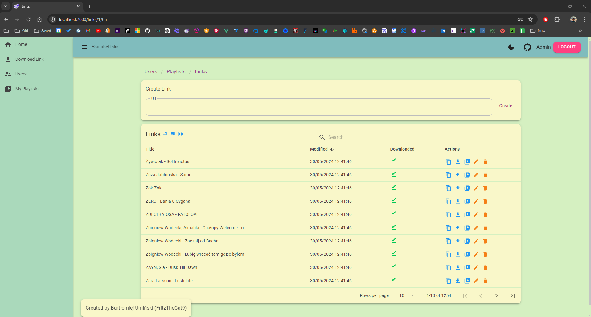
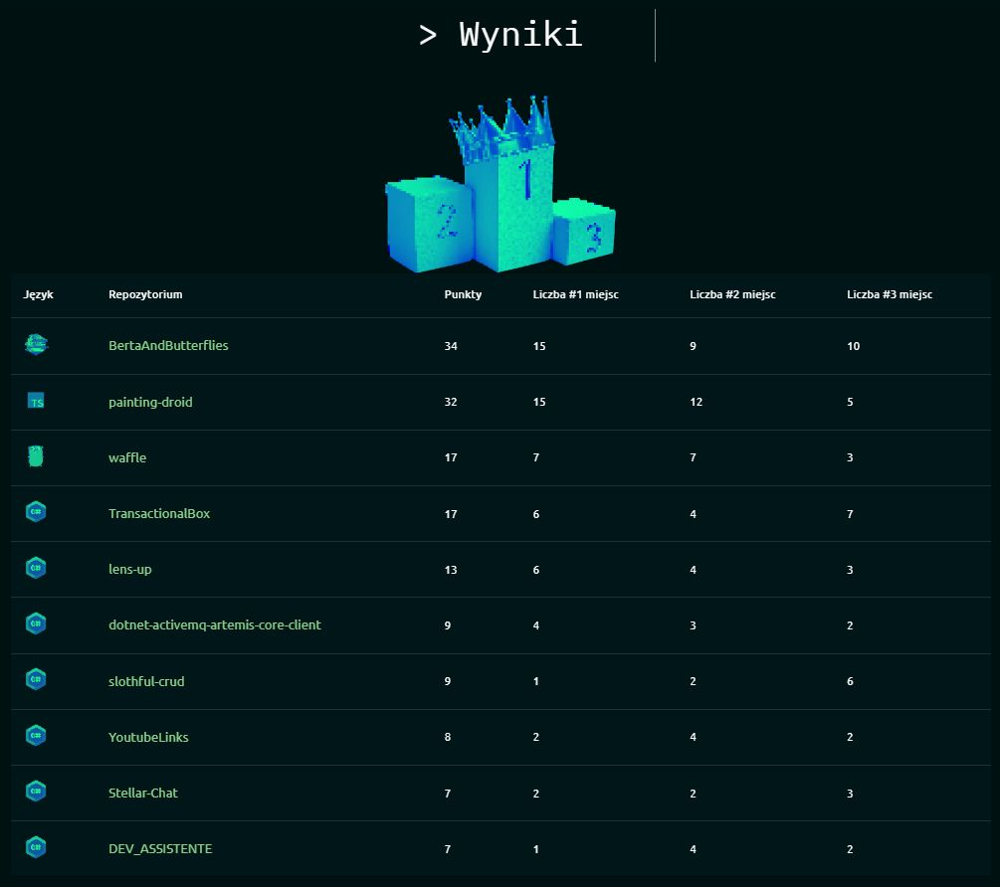
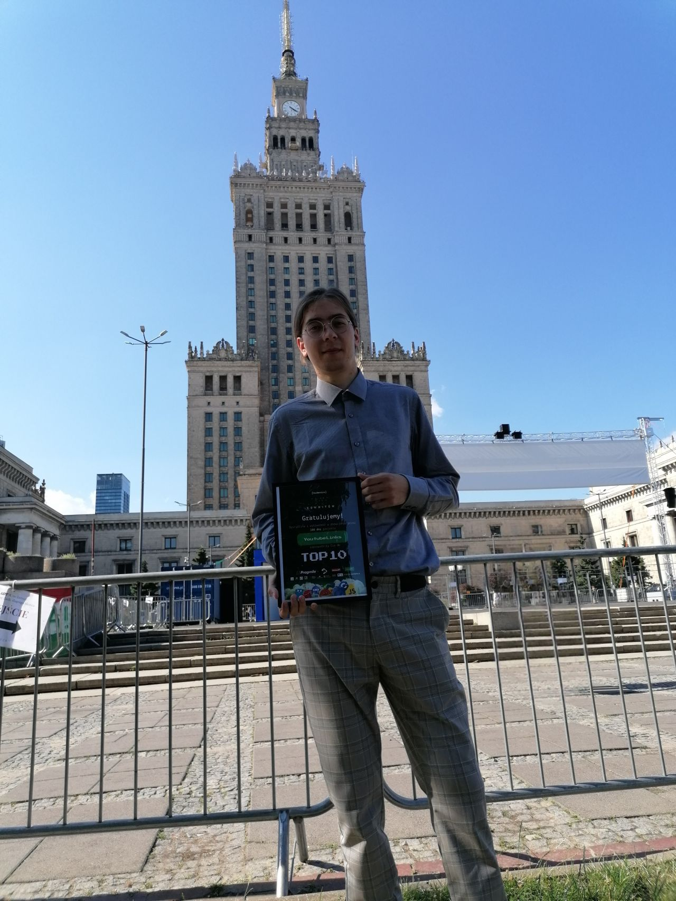

# YoutubeLinks

I achieved 8th place in the "100 Commits" competition organized by DevMentors. Over 100 days, I developed the "
YoutubeLinks" application, which allows users to create playlists from YouTube links and download those playlists as MP3
and MP4 files.

Downloading playlists as MP3 and MP4 files, tested successfully on over 3000 links.

## Youtube video presentation:

[](https://www.youtube.com/watch?v=G1gY-jynpu0)

Max downloaded mp3 file: length - 03:31:45, size - 391 MB\
Max downloaded mp4 file: length - 25:44, size - 973 MB\
Larger files not tested or can not work correctly.

## Table of contents

* [Youtube video](#youtube-video-presentation)
* [Launch](#launch)
* [Presentation](#presentation)
* [Technologies](#technologies)
* [Architecture](#architecture)
* [Project types and references](#project-types-and-references)
* [Packages](#packages)
* [Features](#features)
* [Roles](#roles)
* [Project status](#project-status)

## Launch

Run application with one command (setup all docker containers, create database, apply migrations):

```
cd C:\Users\bartl\source\repos\YoutubeLinks
docker compose up --build -d
```

Created containers:

- C# Web API backend:

```
http://localhost:5000
```

- Blazor WASM frontend:

```
http://localhost:7000
```

- MSSQL database:

```
Host: localhost 
Port: 1433 
Database/Schema: YoutubeLinks
Username: sa
Password: Password1!
Server: youtubelinks.database
```

- Seq Api logs:

```
http://localhost:8081
```

Login credentials:

```
Admin:
- Email: ytlinksapp@gmail.com
- Password: Asd123!
User:
- Email: ytlinksapp1@gmail.com
- Password: Asd123!
```

If You have any problems check issue below or ask me in GitHub issues:
https://github.com/FritzTheCat9/YoutubeLinks/issues/52

## Presentation

Users view:


Playlists view:


Links view:


Links grid view:


Download playlist view:


## Technologies

- C# 12
- .NET 8.0
- Blazor WebAssembly
- Vue 3.4.21

## Architecture

Blazor WebAssembly frontend with .NET Minimal API backend connecting to the MSSQL database. Monolithic architecture with
Vertical Slices. Code separated by feature.

## Project types and references

- YoutubeLinks.Api - ASP .NET Core Web API (Backend)
- YoutubeLinks.Blazor - Blazor WebAssembly Standalone App (Frontend)
- YoutubeLinks.Shared - Class Library (Backend and Frontend shared code)
- YoutubeLinks.UnitTests - xUnit Test Project (Unit Tests)
- YoutubeLinks.E2E - NUnit Test Project (E2E Tests)
- youtube-links - Vue Project (Frontend 2)

## Packages

Nuget packages and libraries used in projects.

- Api
    - [EntityFrameworkCore](https://www.nuget.org/packages/Microsoft.EntityFrameworkCore.SqlServer) - ORM for connecting
      to the database
    - [MediatR](https://www.nuget.org/packages/MediatR/) - CQRS, Vertical Slices (code separated by Features)
    - [FluentValidation](https://www.nuget.org/packages/FluentValidation) - Commands, Queries and server side logic
      validation
    - [FluentEmail](https://www.nuget.org/packages/FluentEmail.Razor) - Sending registration confirmation email and
      registration succeeded email
    - [Serilog](https://www.nuget.org/packages/Serilog/3.1.2-dev-02097) - Logging to console and file
    - [JwtBearer](https://www.nuget.org/packages/Microsoft.AspNetCore.Authentication.JwtBearer) - Jwt Token
      Authentication
    - [Swagger](https://www.nuget.org/packages/Swashbuckle.AspNetCore) - Manual Api testing
    - [YoutubeDLSharp](https://github.com/Bluegrams/YoutubeDLSharp) - Get YouTube videos titles, download videos as .mp3
      and .mp4 files
- Blazor
    - [MudBlazor](https://www.nuget.org/packages/MudBlazor) - Blazor UI library
    - [Blazored.FluentValidation](https://www.nuget.org/packages/Blazored.FluentValidation) - Frontend validation +
      Backend validation
    - [Blazored.LocalStorage](https://www.nuget.org/packages/Blazored.LocalStorage) - store Jwt Token in local storage

## Features

- Users
    - Register new user and send confirmation email
    - Resend confirmation email
    - Confirm user registration and send registration success email
    - Login user if email is confirmed
    - Refresh Jwt Token
    - Forgot password
    - Update user color theme
    - Get all users (paginated, sorted and filtered)
    - Get selected user
- Playlist
    - Create playlist
    - Delete playlist
    - Update playlist (set playlist as public / private)
    - Export playlist (.json, .txt)
    - Import playlist (.json, .txt)
    - Download playlist (only undownloaded links)
    - Mark all playlist links as downloaded / undownloaded
    - Get all public playlists (paginated, sorted and filtered)
    - Get all user playlists (paginated, sorted and filtered)
    - Get selected playlist
- Link
    - Create link
    - Delete link
    - Update link (mark as downloaded, change title)
    - Set link downloaded flag
    - Download link (.mp3, .mp4)
    - Download single link (no need to add link to the playlist)
    - Get all playlist links (paginated, sorted and filtered)
    - Get selected link
    - Links grid / table view

## Roles

- Admin - ony one user have Admin role
- User - can view website data, can do CRUD operations on owned playlists and links
- Anonymous - can view website data (public playlists / links)

## Project status

Project created as part of the "[100 Commits](https://100commitow.pl)" competition. The challenge is to add changes to
the repository every day for 100 days.



I achieved 8th place in the "[100 Commits](https://100commitow.pl)" competition organized
by "[DevMentors.io](https://devmentors.io)". Over 100 days, I developed the "YoutubeLinks" application, which allows
users to create playlists from YouTube links and download those playlists as MP3 and MP4 files.



This project was a significant adventure that taught me perseverance and systematic work to achieve my project goals
within the given timeframe. The "[100 Commits](https://100commitow.pl)" gala was a fantastic event, well-organized with
engaging talks. I look forward to a potential second edition of the competition in the future.
