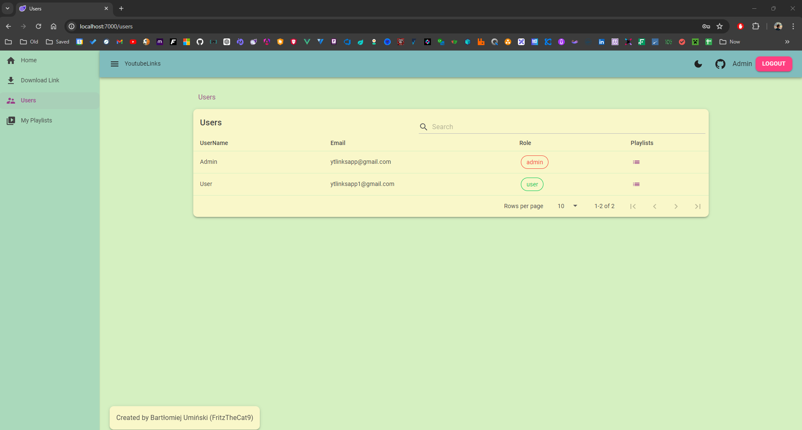
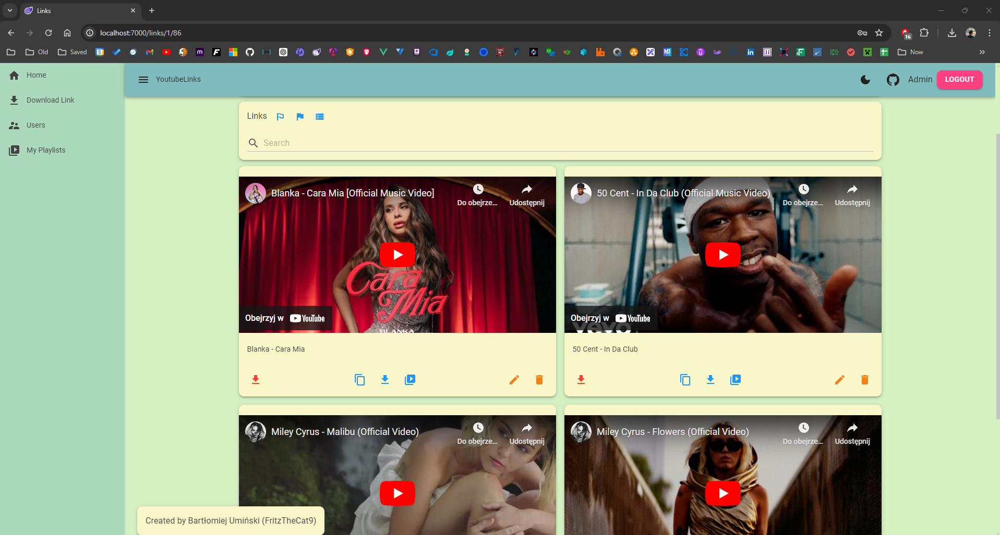
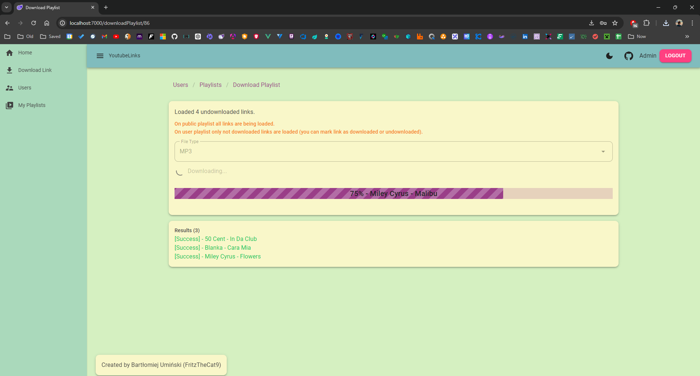

# YoutubeLinks
The YoutubeLinks app will allow users to save YouTube links as playlists. Users will be able to download mp3 files from the playlists they create.

Users view:

Playlists view:

Links view:

Links grid view:

Download playlist view (now you can open winamp and be happy with your newly downloaded playlist):

Update: Creating playlists works, downloading single link as .mp3 and .mp4 works, downloading playlist works. More improvements will be added.

## Table of contents
* [Technologies](#technologies)
* [Architecture](#architecture)
* [Project types and references](#project-types-and-references)
* [Projects content](#projects-content)
* [Packages](#packages)
* [Features](#features)
* [Roles](#roles)
* [Launch](#launch)
* [Project status](#project-status)

## Technologies
- C# 12
- .NET 8.0
- Blazor WebAssembly

## Architecture
Blazor WebAssembly frontend with .NET Minimal API backend connecting to the MSSQL database. Monolithic architecture with Vertical Slices. Code separated by feature.

## Project types and references
- YoutubeLinks.Api - ASP .NET Core Web API (Backend)
- YoutubeLinks.Blazor - Blazor WebAssembly Standalone App (Frontend)
- YoutubeLinks.Shared - Class Library (Backend and Frontend shared code)

## Projects content
// TODO: complete later

## Packages
Nuget packages and libraries used in projects.

- Api
    - [EntityFrameworkCore](https://www.nuget.org/packages/Microsoft.EntityFrameworkCore.SqlServer) - ORM for connecting to the database
    - [MediatR](https://www.nuget.org/packages/MediatR/) - CQRS, Vertical Slices (code separated by Features)
    - [FluentValidation](https://www.nuget.org/packages/FluentValidation) - Commands, Queries and server side logic validation
    - [FluentEmail](https://www.nuget.org/packages/FluentEmail.Razor) - Sending registation confirmation email and registration successed email 
    - [Serilog](https://www.nuget.org/packages/Serilog/3.1.2-dev-02097) - Logging to console and file
    - [JwtBearer](https://www.nuget.org/packages/Microsoft.AspNetCore.Authentication.JwtBearer) - Jwt Token Authentication
    - [Swagger](https://www.nuget.org/packages/Swashbuckle.AspNetCore) - Manual Api testing
- Blazor
    - [MudBlazor](https://www.nuget.org/packages/MudBlazor) - Blazor UI library
    - [Blazored.FluentValidation](https://www.nuget.org/packages/Blazored.FluentValidation) - Frontend validation + Backend validation
    - [Blazored.LocalStorage](https://www.nuget.org/packages/Blazored.LocalStorage) - store Jwt Token in local storage
    
## Features
- Users
    - Register new user and send confirmation email
    - Confirm user registration and send registration success email
    - Login user if email is confirmed
    - Get all users (paginated, sorted and filtered)
    - Get selected user
- Playlist
    - Create playlist
    - Delete playlist
    - Update playlist
    - Get all user playlists (paginated, sorted and filtered)
    - Get selected playlist
    - Download playlist
    - Import playlist
    - Export playlist
    - Set all playlist links as downloaded / undownloaded
- Link
    - Create link
    - Delete link
    - Update link
    - Get all playlist links (paginated, sorted and filtered)
    - Get selected link
    - Download link
    - Mark link as downloaded (manually if we dont want to download this link)
    - Unmark downloaded flag

## Roles
- Admin - ony one user have Admin role, access to Admin Panel (if needed)
- User - can view website data, can do CRUD operations on owned playlists and links
- Anonymous - can view website data (public playlists / links)

## Launch
// TODO: Add launch instruction (docker compose / database creation)

Docker MSSQL database.
Blazor WASM App frontend.
C# Minimal Web Api backend.

## Project status
Project created as part of the "[100 Commits](https://100commitow.pl)" competition. The challenge is to add changes to the repository every day for 100 days.